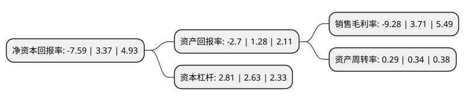

> 本页面由自动化程序生成于 2022年5月20日 01:01
> 内容可能存在错误，如有bug请提交issue至：https://github.com/Eroleice/doc-pi/issues
{.is-warning}

# 上市公司基本情况

## 基本资料

吉林化纤股份有限公司（以下简称“吉林化纤”）成立于1988年11月09日，吉林市。于1996年08月02日在深交所主板上市。

吉林化纤注册资本216,831.144万元，主要业务:生产销售粘胶长丝和粘胶短纤维。主要产品:粘胶长，短丝，浆粕。以下是详细信息：

- 公司名称: 吉林化纤股份有限公司
- 股票代码: 000420.SZ
- 所在地: 吉林 - 吉林市
- 成立日期: 1988年11月09日
- 注册资本: 216,831.144万元
- 法定代表人: 宋德武
- 主营业务: 生产销售粘胶长丝和粘胶短纤维主要产品:粘胶长，短丝，浆粕
- 公司官网: www.jlcfc.com
- 公司介绍: 公司是一个集化纤生产、商业贸易、建筑安装等为一体的大型、综合性企业，是全国520户重点企业、中国500强脊梁企业。公司主要从事粘胶纤维的生产和销售，从事醋酐的生产和研发，产品包括粘胶短纤维、粘胶长丝、腈纶纤维、化纤浆粕、纱线和纸制品六大系列450多个品种，产品质量位居同行业前列。“白山”牌商标被认定为“中国驰名商标”，“白山”牌粘胶短纤维、粘胶长丝被评为“中国名牌产品”。公司先后获得全国纺织工业先进集体、中国纺织品牌文化创新企业等荣誉称号，人造纤维制造行业排头兵企业。

## 股东及高管情况

上市公司第一大股东为吉林化纤集团有限责任公司，持股318,067,074股，占比14.67%，**疑似为**上市公司实际控制人。

截至2021年12月01日，上市公司的前十大股东中，共有7名机构股东，3个产品账户，其中5%以上大股东共有6名。上市公司前十大股东明细如下：

> 未能通过持股比例判定出上市公司实际控制人（持股30%以上）
> 可能存在通过间接持股、联合持股、协议控制等方式拥有实际控制权的主体，具体请参考上市公司定期公告！
{.is-warning}

> 截至2021年12月01日，上市公司前十大股东信息如下：

| 股东名称 | 持股数量（股） | 持股比例 |
| --- | --- | --- |
| 吉林化纤集团有限责任公司 | 318,067,074 | 14.67% |
| 吉林化纤集团有限责任公司 | 318,067,074 | 14.67% |
| 上海方大投资管理有限责任公司 | 274,525,676 | 12.6608% |
| 上海方大投资管理有限责任公司 | 255,159,448 | 11.7677% |
| 吉林市国有资本发展控股集团有限公司 | 171,834,911 | 7.92% |
| 吉林市国有资本发展控股集团有限公司 | 171,834,911 | 7.92% |
| 吉林省财金资本投资有限责任公司 | 100,000,000 | 4.61% |
| 中国工商银行股份有限公司-前海开源新经济灵活配置混合型证券投资基金 | 26,263,500 | 1.21% |
| 上海子午投资管理有限公司-子午启程二号私募证券投资基金 | 22,350,000 | 1.03% |
| 广州康祺资产管理中心(有限合伙)-康祺资产稳增长1号证券投资基金 | 21,404,019 | 0.99% |

## 杜邦分析

> 数据列示周期：2020年 | 2019年 | 2018年
{.is-info}

上市公司的净资产收益率在近一年有所下降，下降幅度为-325.22%，其变化情况分解如下：
- 上市公司的销售毛利率在近一年下降了-350.13%，可能是生产效率的下降、商品原材料价格上涨或商品价格的下跌所致。
- 上市公司的资产周转率在近一年下降了-14.71%，可能是源自于更慢的销售回款或库存管理效果下降。
- 上市公司的财务杠杆比率在近一年上升了6.84%，可能是增加负债扩大生产规模。

