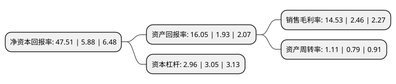

> 本页面由自动化程序生成于 2022年5月20日 01:03
> 内容可能存在错误，如有bug请提交issue至：https://github.com/Eroleice/doc-pi/issues
{.is-warning}

# 上市公司基本情况

## 基本资料

恒天海龙股份有限公司（以下简称“恒天海龙”）成立于1989年07月21日，潍坊市。于1996年12月26日在深交所主板上市。

恒天海龙注册资本86,397.795万元，主要业务:棉浆粕，粘胶纤维，帘帆布的生产与销售。主要产品:粘胶长丝，粘胶短丝，浆粕，帆布，帘子布。以下是详细信息：

- 公司名称: 恒天海龙股份有限公司
- 股票代码: 000677.SZ
- 所在地: 山东 - 潍坊市
- 成立日期: 1989年07月21日
- 注册资本: 86,397.795万元
- 法定代表人: 姜大广
- 主营业务: 棉浆粕，粘胶纤维，帘帆布的生产与销售主要产品:粘胶长丝，粘胶短丝，浆粕，帆布，帘子布
- 公司官网: www.helon.cn
- 公司介绍: 公司主要从事粘胶纤维及帘帆布的生产与销售，主要产品包括粘胶短纤、粘胶长丝、帘子布和帆布。公司是高新技术企业，拥有完善的科研开发体系，技术中心是中国橡胶工业协会纤维骨架材料研发中心、山东省省级企业技术中心、山东省纤维骨架材料工程技术研究中心。其中与中国橡胶工业协会共同创建的“中国橡胶工业协会纤维骨架材料研发中心”，是国内纤维骨架材料行业唯一的一家专业科研机构。研制开发的高性能高模低缩浸胶涤纶帘子布、EP帆布被评为“国家级新产品”；芳纶帆布填补国内空白。公司已通过ISO9001质量管理体系、ISO14001环境管理体系和OHSAS18001职业健康安全管理体系认证。

## 股东及高管情况

上市公司第一大股东为温州康南科技有限公司，持股200,000,000股，占比23.15%，**疑似为**上市公司实际控制人。

截至2022年03月31日，上市公司的前十大股东中，共有7名自然人股东，2名机构股东，1名其他股东，其中5%以上大股东共有2名。上市公司前十大股东明细如下：

> 未能通过持股比例判定出上市公司实际控制人（持股30%以上）
> 可能存在通过间接持股、联合持股、协议控制等方式拥有实际控制权的主体，具体请参考上市公司定期公告！
{.is-warning}

> 截至2022年03月31日，上市公司前十大股东信息如下：

| 股东名称 | 持股数量（股） | 持股比例 |
| --- | --- | --- |
| 温州康南科技有限公司 | 200,000,000 | 23.15% |
| 中国恒天集团有限公司 | 88,050,247 | 10.19% |
| 周娟 | 23,053,542 | 2.67% |
| 武慧 | 10,050,301 | 1.16% |
| 张佑生 | 8,000,000 | 0.93% |
| 北京远流天地文化发展中心 | 3,471,050 | 0.4% |
| 张秀 | 3,405,100 | 0.39% |
| 杨文娥 | 2,380,375 | 0.28% |
| 李凤燕 | 2,339,200 | 0.27% |
| 陈丽萍 | 2,271,381 | 0.26% |

## 利润表分析

上市公司2021年总收入为10.67亿元，净利润为1.55亿元，实现盈利。

## 杜邦分析

> 数据列示周期：2021年 | 2020年 | 2019年
{.is-info}

上市公司的净资产收益率在近一年有所上升，上升幅度为707.99%，其变化情况分解如下：
- 上市公司的销售毛利率在近一年上升了490.65%，可能是生产效率的提升、商品原材料价格下跌或商品价格的上涨所致。
- 上市公司的资产周转率在近一年上升了40.51%，可能是源自于更快的销售回款或库存管理效果提升。
- 上市公司的财务杠杆比率在近一年下降了-2.95%，可能是减少负债降低财务费用。

