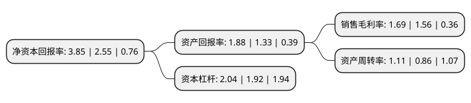

> 本页面由自动化程序生成于 2022年5月20日 01:03
> 内容可能存在错误，如有bug请提交issue至：https://github.com/Eroleice/doc-pi/issues
{.is-warning}

# 上市公司基本情况

## 基本资料

广东新会美达锦纶股份有限公司（以下简称“美达股份”）成立于1992年11月08日，江门市。于1997年06月19日在深交所主板上市。

美达股份注册资本52,813.962万元，主要产品及提供的劳务:锦纶6切片的生产，纺丝，织造，染整。以下是详细信息：

- 公司名称: 广东新会美达锦纶股份有限公司
- 股票代码: 000782.SZ
- 所在地: 广东 - 江门市
- 成立日期: 1992年11月08日
- 注册资本: 52,813.962万元
- 法定代表人: 何洪胜
- 主营业务: 主要产品及提供的劳务:锦纶6切片的生产，纺丝，织造，染整
- 公司官网: www.meidanylon.com
- 公司介绍: 公司是全国首家引进锦纶6生产设备的厂家，目前已形成高分子聚合物为龙头、纤维新材料为主体的产业结构布局。公司属国内唯一涵盖聚合、纺丝、针织和印染的企业，机台齐备，产品丰富，是国内锦纶行业的领跑者。公司名列中国化学纤维行业10强企业、全国500家重点企业和广东省50户工业龙头企业，获得了AAA+国家质量信用企业称号。公司设有国家级企业技术中心、行业内第一个博士后科研工作站和省级工程技术研究开发中心，拥有大量资深专业技术人才，被列入国家高新技术企业和技术创新优势企业。

## 股东及高管情况

上市公司第一大股东为青岛昌盛日电新能源控股有限公司，持股146,991,124股，占比27.83%，**疑似为**上市公司实际控制人。

截至2022年03月31日，上市公司的前十大股东中，共有7名自然人股东，2名机构股东，1个产品账户，其中5%以上大股东共有1名。上市公司前十大股东明细如下：

> 未能通过持股比例判定出上市公司实际控制人（持股30%以上）
> 可能存在通过间接持股、联合持股、协议控制等方式拥有实际控制权的主体，具体请参考上市公司定期公告！
{.is-warning}

> 截至2022年03月31日，上市公司前十大股东信息如下：

| 股东名称 | 持股数量（股） | 持股比例 |
| --- | --- | --- |
| 青岛昌盛日电新能源控股有限公司 | 146,991,124 | 27.83% |
| 林清怡 | 11,659,516 | 2.21% |
| 财通基金-青岛城投金融控股集团有限公司-财通基金天禧188号单一资产管理计划 | 7,920,000 | 1.5% |
| 太仓德源投资管理中心(有限合伙) | 7,139,232 | 1.35% |
| 郑本心 | 4,999,989 | 0.95% |
| 陈品钦 | 4,073,000 | 0.77% |
| 薛建新 | 3,860,000 | 0.73% |
| 滕顺祥 | 3,844,281 | 0.73% |
| 朱政 | 2,580,000 | 0.49% |
| 张启旭 | 2,231,200 | 0.42% |

## 利润表分析

上市公司2021年总收入为33.2亿元，净利润为0.56亿元，实现盈利。

## 杜邦分析

> 数据列示周期：2021年 | 2020年 | 2019年
{.is-info}

上市公司的净资产收益率在近一年有所上升，上升幅度为50.98%，其变化情况分解如下：
- 上市公司的销售毛利率在近一年上升了8.33%，可能是生产效率的提升、商品原材料价格下跌或商品价格的上涨所致。
- 上市公司的资产周转率在近一年上升了29.07%，可能是源自于更快的销售回款或库存管理效果提升。
- 上市公司的财务杠杆比率在近一年上升了6.25%，可能是增加负债扩大生产规模。

