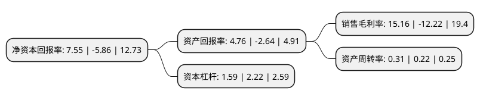

> 本页面由自动化程序生成于 2022年5月20日 01:04
> 内容可能存在错误，如有bug请提交issue至：https://github.com/Eroleice/doc-pi/issues
{.is-warning}

# 上市公司基本情况

## 基本资料

江苏华西村股份有限公司（以下简称“华西股份”）成立于1991年11月08日，无锡市。于1999年08月10日在深交所主板上市。

华西股份注册资本88,601.289万元，主营业务:危险化学品的销售。化工原料，化学纤维品的制造;国内贸易。以下是详细信息：

- 公司名称: 江苏华西村股份有限公司
- 股票代码: 000936.SZ
- 所在地: 江苏 - 无锡市
- 成立日期: 1991年11月08日
- 注册资本: 88,601.289万元
- 法定代表人: 吴协恩
- 主营业务: 主营业务:危险化学品的销售化工原料，化学纤维品的制造;国内贸易
- 公司官网: www.jshuaxicun.com
- 公司介绍: 公司主营业务分为涤纶化纤的研发、生产和销售，石化物流仓储，投资并购和资产管理。公司拥有一个省级科技中心，拥有多个发明专利、实用新型专利、高新技术产品和特许经营许可证。目前，公司自主研发的水刺、荧光增白等产品已成功进入欧美高端市场。公司还将与高校和科研所进行产学研合作，进一步开发新型特种纤维。经过十多年的经营发展，华西化纤在涤纶短纤维市场已树立了诚信品牌形象，拥有了一大批长期客户，保证了市场的稳定性，同时在产品价格上也形成了一定的优势。公司利用自身的设备优势和人才优势，成功地开发了高端、差别化产品，提高了产品的附加值，并在差别化纤维领域占有领先地位，在一些差别化产品上有了定价权，提高了企业的效益。公司已通过ISO质量、环境、安全三位一体认证，现场管理大力推进“5S”管理和全面推行内部风险控制等，有效促进了公司内部各项管理水平的提升和经营风险的管控，促进了企业的健康持续发展。

## 股东及高管情况

上市公司第一大股东为江苏华西集团有限公司，持股359,629,483股，占比40.59%，为上市公司实际控制人。

截至2022年03月31日，上市公司的前十大股东中，共有8名自然人股东，1名机构股东，1个海外主体，其中5%以上大股东共有1名。上市公司前十大股东明细如下：

> 截至2022年03月31日，上市公司前十大股东信息如下：

| 股东名称 | 持股数量（股） | 持股比例 |
| --- | --- | --- |
| 江苏华西集团有限公司 | 359,629,483 | 40.59% |
| 香港中央结算有限公司(陆股通) | 10,541,024 | 1.19% |
| 陈朝晖 | 7,620,500 | 0.86% |
| 蔡玉栋 | 6,736,500 | 0.76% |
| 杨光勇 | 5,938,004 | 0.67% |
| 宋建新 | 4,220,100 | 0.48% |
| 李蓬勃 | 4,093,900 | 0.46% |
| 李敏 | 2,920,100 | 0.33% |
| 沈加权 | 2,500,000 | 0.28% |
| 朱飞 | 2,036,200 | 0.23% |

## 利润表分析

上市公司2021年总收入为24.18亿元，净利润为3.66亿元，实现盈利。

## 杜邦分析

> 数据列示周期：2021年 | 2020年 | 2019年
{.is-info}

上市公司的净资产收益率在近一年有所下降，下降幅度为-228.84%，其变化情况分解如下：
- 上市公司的销售毛利率在近一年下降了-224.06%，可能是生产效率的下降、商品原材料价格上涨或商品价格的下跌所致。
- 上市公司的资产周转率在近一年上升了40.91%，可能是源自于更快的销售回款或库存管理效果提升。
- 上市公司的财务杠杆比率在近一年下降了-28.38%，可能是减少负债降低财务费用。

