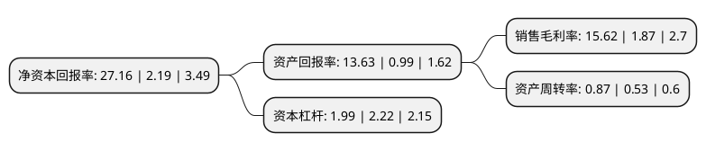

> 本页面由自动化程序生成于 2022年5月20日 01:04
> 内容可能存在错误，如有bug请提交issue至：https://github.com/Eroleice/doc-pi/issues
{.is-warning}

# 上市公司基本情况

## 基本资料

新乡化纤股份有限公司（以下简称“新乡化纤”）成立于1997年01月09日，新乡市。于1999年10月21日在深交所主板上市。

新乡化纤注册资本146,672.778万元，主要业务:粘胶长丝和粘胶短纤维的生产与销售。主要产品:粘胶长丝，粘胶短纤维，纱，线。以下是详细信息：

- 公司名称: 新乡化纤股份有限公司
- 股票代码: 000949.SZ
- 所在地: 河南 - 新乡市
- 成立日期: 1997年01月09日
- 注册资本: 146,672.778万元
- 法定代表人: 邵长金
- 主营业务: 粘胶长丝和粘胶短纤维的生产与销售主要产品:粘胶长丝，粘胶短纤维，纱，线
- 公司官网: www.bailu.com
- 公司介绍: 公司是我国生产化纤纺织原料的大型一类企业，生产规模、经济效益在中国粘胶纤维行业中名列前茅，公司主要产品有半连续纺粘胶人造丝、连续纺粘胶人造丝、粘胶短纤维、涤纶民用长丝、氨纶共五大系列300多个品种。近年来又相继研制出了有色粘胶纤维、竹浆粘胶纤维、大豆粘胶纤维等十余个新品种，获得国家专利30多项，产品畅销国内外市场，产品注册商标为“白鹭”牌。

## 股东及高管情况

上市公司第一大股东为新乡白鹭投资集团有限公司，持股442,507,079股，占比30.17%，为上市公司实际控制人。

截至2022年03月31日，上市公司的前十大股东中，共有3名自然人股东，4名机构股东，2个产品账户，1个海外主体，其中5%以上大股东共有2名。上市公司前十大股东明细如下：

> 截至2022年03月31日，上市公司前十大股东信息如下：

| 股东名称 | 持股数量（股） | 持股比例 |
| --- | --- | --- |
| 新乡白鹭投资集团有限公司 | 442,507,079 | 30.17% |
| 中原资产管理有限公司 | 110,529,953 | 7.54% |
| 中原股权投资管理有限公司 | 59,054,381 | 4.03% |
| 曹伟娟 | 26,600,000 | 1.81% |
| 香港中央结算有限公司(陆股通) | 19,969,953 | 1.36% |
| 新乡市国有资产经营有限公司 | 13,026,000 | 0.89% |
| 嘉实资本-河南中原古泉投资管理有限公司-嘉实资本嘉臻8号单一资产管理计划 | 13,000,000 | 0.89% |
| 嘉实资本-河南中原古泉投资管理有限公司-嘉实资本嘉臻7号单一资产管理计划 | 13,000,000 | 0.89% |
| 吴喜强 | 10,080,043 | 0.69% |
| 张森箭 | 6,000,000 | 0.41% |

## 利润表分析

上市公司2021年总收入为87.4亿元，净利润为13.65亿元，实现盈利。

## 杜邦分析

> 数据列示周期：2021年 | 2020年 | 2019年
{.is-info}

上市公司的净资产收益率在近一年有所上升，上升幅度为1140.18%，其变化情况分解如下：
- 上市公司的销售毛利率在近一年上升了735.29%，可能是生产效率的提升、商品原材料价格下跌或商品价格的上涨所致。
- 上市公司的资产周转率在近一年上升了64.15%，可能是源自于更快的销售回款或库存管理效果提升。
- 上市公司的财务杠杆比率在近一年下降了-10.36%，可能是减少负债降低财务费用。

