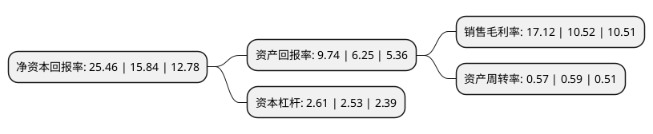

> 本页面由自动化程序生成于 2022年5月20日 01:06
> 内容可能存在错误，如有bug请提交issue至：https://github.com/Eroleice/doc-pi/issues
{.is-warning}

# 上市公司基本情况

## 基本资料

中材科技股份有限公司（以下简称“中材科技”）成立于2001年12月28日，南京市。于2006年11月20日在深交所中小板上市。

中材科技注册资本167,812.358万元，主营业务:风电叶片，玻璃纤维和其他板块。其他版块主要产品为高压复合气瓶，膜材料制品(高温过滤材料，玻璃纤维纸)，锂电池隔膜，技术与装备，及少量贸易和水务以下是详细信息：

- 公司名称: 中材科技股份有限公司
- 股票代码: 002080.SZ
- 所在地: 江苏 - 南京市
- 成立日期: 2001年12月28日
- 注册资本: 167,812.358万元
- 法定代表人: 薛忠民
- 主营业务: 主营业务:风电叶片，玻璃纤维和其他板块其他版块主要产品为高压复合气瓶，膜材料制品(高温过滤材料，玻璃纤维纸)，锂电池隔膜，技术与装备，及少量贸易和水务
- 公司官网: www.sinomatech.com
- 公司介绍: 公司是我国特种纤维复合材料的技术发源地，拥有完整的非金属矿物材料、玻璃纤维、纤维复合材料技术产业链，是我国特种纤维复合材料领域集研发、设计、产品制造与销售、技术装备集成于一体的国家级高新技术企业。业务产品紧扣新能源、航空航天、节能减排、国防军工等应用领域。承继了原南京玻璃纤维研究设计院、北京玻璃钢研究设计院和苏州非金属矿工业设计研究院三个国家级科研院所多年的核心技术资源和人才优势。公司是国家首批创新型企业、国家首批技术创新示范企业、国家高新技术企业，拥有国家重点实验室、国家级企业技术中心、国家级工程技术研究中心、博士后工作站，形成了稳定高效的高层次研发平台，拥有一支国内优秀的新材料研发人才队伍。

## 股东及高管情况

上市公司第一大股东为中国建材股份有限公司，持股1,010,874,604股，占比60.24%，为上市公司实际控制人。

截至2022年03月31日，上市公司的前十大股东中，共有3名机构股东，4个产品账户，2个海外主体，1名其他股东，其中5%以上大股东共有2名。上市公司前十大股东明细如下：

> 截至2022年03月31日，上市公司前十大股东信息如下：

| 股东名称 | 持股数量（股） | 持股比例 |
| --- | --- | --- |
| 中国建材股份有限公司 | 1,010,874,604 | 60.24% |
| 香港中央结算有限公司(陆股通) | 109,667,944 | 6.54% |
| 上海浦东发展银行股份有限公司-易方达裕祥回报债券型证券投资基金 | 11,803,836 | 0.7% |
| 中国人寿保险股份有限公司-传统-普通保险产品-005L-CT001深 | 11,288,032 | 0.67% |
| BILL & MELINDA GATES FOUNDATION TRUST | 10,814,484 | 0.64% |
| 南京彤天科技实业股份有限公司 | 7,395,408 | 0.44% |
| 澳门金融管理局-自有资金 | 7,250,000 | 0.43% |
| 全国社保基金一一六组合 | 6,940,985 | 0.41% |
| 国信国投基金管理(北京)有限公司-北京华宇瑞泰股权投资合伙企业(有限合伙) | 4,610,066 | 0.27% |
| 中国人寿保险股份有限公司-分红-个人分红-005L-FH002深 | 4,269,971 | 0.25% |

## 利润表分析

上市公司2021年总收入为202.95亿元，净利润为34.75亿元，实现盈利。

## 杜邦分析

> 数据列示周期：2021年 | 2020年 | 2019年
{.is-info}

上市公司的净资产收益率在近一年有所上升，上升幅度为60.73%，其变化情况分解如下：
- 上市公司的销售毛利率在近一年上升了62.74%，可能是生产效率的提升、商品原材料价格下跌或商品价格的上涨所致。
- 上市公司的资产周转率在近一年下降了-3.39%，可能是源自于更慢的销售回款或库存管理效果下降。
- 上市公司的财务杠杆比率在近一年上升了3.16%，可能是增加负债扩大生产规模。

