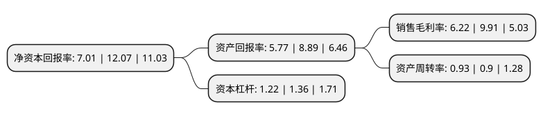

> 本页面由自动化程序生成于 2022年5月20日 01:13
> 内容可能存在错误，如有bug请提交issue至：https://github.com/Eroleice/doc-pi/issues
{.is-warning}

# 上市公司基本情况

## 基本资料

优彩环保资源科技股份有限公司（以下简称“优彩资源”）成立于2003年08月12日，无锡市。于2020年09月25日在深交所中小板上市。

优彩资源注册资本32,639.84万元，公司主营业务为涤纶纤维及其制品的研发，生产，销售，主要产品包括再生有色涤纶短纤维，低熔点涤纶短纤维和涤纶非织造布等。以下是详细信息：

- 公司名称: 优彩环保资源科技股份有限公司
- 股票代码: 002998.SZ
- 所在地: 江苏 - 无锡市
- 成立日期: 2003年08月12日
- 注册资本: 32,639.84万元
- 法定代表人: 戴泽新
- 主营业务: 公司主营业务为涤纶纤维及其制品的研发，生产，销售，主要产品包括再生有色涤纶短纤维，低熔点涤纶短纤维和涤纶非织造布等
- 公司官网: www.elitecolor.cn
- 公司介绍: 公司秉承国家“构建节约型社会、发展循环经济”的政策导向，以创新求生存，以创新求发展，在涤纶纤维循环利用领域不断开发新产品、新技术，先后推出了具备有色、异形、抗菌除臭等多种差别化功能型再生涤纶短纤维新产品和具有低碳环保、易热粘结、热稳定性好等诸多优点的功能型复合低熔点涤纶短纤维。公司主营业务为涤纶纤维及其制品的研发、生产、销售，主要产品包括再生有色涤纶短纤维、低熔点涤纶短纤维和涤纶非织造布等。自成立以来，公司主营业务未发生变化。2018年3月，公司被中国化学纤维工业协会评为“2017年度全国化纤行业品牌质量先进企业”；2018年被中国循环经济协会评为“全国循环经济技术中心”；2018年12月，公司获得国务院颁发的国家科学技术进步二等奖，进一步体现了公司科技创新的实力。

## 股东及高管情况

上市公司第一大股东为戴泽新，持股109,238,171股，占比33.47%，为上市公司实际控制人。

截至2022年03月31日，上市公司的前十大股东中，共有4名自然人股东，6名机构股东，其中5%以上大股东共有3名。上市公司前十大股东明细如下：

> 截至2022年03月31日，上市公司前十大股东信息如下：

| 股东名称 | 持股数量（股） | 持股比例 |
| --- | --- | --- |
| 戴泽新 | 109,238,171 | 33.47% |
| 王雪萍 | 49,322,742 | 15.11% |
| 上海凯石股权投资管理中心(有限合伙)-上海凯峰投资合伙企业(有限合伙) | 21,851,800 | 6.69% |
| 江阴市群英投资企业(有限合伙) | 15,826,087 | 4.85% |
| 平潭兴杭旌彩股权投资合伙企业(有限合伙) | 8,616,015 | 2.64% |
| 江阴卓创投资管理合伙企业(有限合伙) | 7,797,567 | 2.39% |
| 陈军 | 3,977,930 | 1.22% |
| 福能一期(平潭)创业投资合伙企业(有限合伙) | 2,807,487 | 0.86% |
| 尤国平 | 2,503,129 | 0.77% |
| 上海菁和投资管理有限公司-宁波永翊股权投资中心(有限合伙) | 2,470,600 | 0.76% |

## 利润表分析

上市公司2021年总收入为16.2亿元，净利润为1亿元，实现盈利。

## 杜邦分析

> 数据列示周期：2021年 | 2020年 | 2019年
{.is-info}

上市公司的净资产收益率在近一年有所下降，下降幅度为-41.92%，其变化情况分解如下：
- 上市公司的销售毛利率在近一年下降了-37.24%，可能是生产效率的下降、商品原材料价格上涨或商品价格的下跌所致。
- 上市公司的资产周转率在近一年上升了3.33%，可能是源自于更快的销售回款或库存管理效果提升。
- 上市公司的财务杠杆比率在近一年下降了-10.29%，可能是减少负债降低财务费用。

