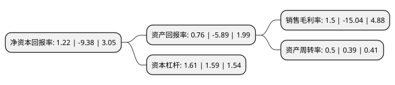

> 本页面由自动化程序生成于 2022年5月20日 01:15
> 内容可能存在错误，如有bug请提交issue至：https://github.com/Eroleice/doc-pi/issues
{.is-warning}

# 上市公司基本情况

## 基本资料

上海华峰超纤科技股份有限公司（以下简称“华峰超纤”）成立于2002年10月24日，上海市。于2011年02月22日在深交所创业板上市。

华峰超纤注册资本176,106.016万元，主营业务为超细纤维聚氨酯合成革的研发，生产，销售与服务，主要产品为超细纤维聚氨酯合成革系列产品，主要包括超细纤维基布，超细纤维绒面革和超细纤维贴面革。以下是详细信息：

- 公司名称: 上海华峰超纤科技股份有限公司
- 股票代码: 300180.SZ
- 所在地: 上海 - 上海市
- 成立日期: 2002年10月24日
- 注册资本: 176,106.016万元
- 法定代表人: 尤小平
- 主营业务: 主营业务为超细纤维聚氨酯合成革的研发，生产，销售与服务，主要产品为超细纤维聚氨酯合成革系列产品，主要包括超细纤维基布，超细纤维绒面革和超细纤维贴面革
- 公司官网: microfibre.huafeng.com
- 公司介绍: 公司专业从事超细纤维材料的开发、生产和销售，拥有包括革用PU树脂、超细束状纤维纺丝、无纺布、含浸等以及贴面、染色等所有超纤产品涉及的工艺研发、生产能力。公司主导产品超纤皮在设计开发上，严格以欧盟各项环保要求为标准，从原材料的选择到生产工艺乃至成品包装上进行严格控制，塑造出公司的绿色生态环保形象。同时采用与天然皮革中束状胶原纤维的结构和性能相似的尼龙超细纤维，制成具有三维网络结构的的高密度无纺布，再填充性能优异具有开式微孔结构的聚氨酯，最大限度的还原真皮优良的触感和舒适度，并在回弹性、强度、防水、防霉变、耐寒、耐磨等性能上全面超越真皮，目前已广泛应用与运动、休闲生活和工业产品等众多领域。公司在高速发展的同时，注重对环境的保护和改善。公司在生产过程中引入科学管理体系，保证生产过程稳定；拥有原料入厂检测、半成品外观检验、半成品物性检测、成品外观检验、成品物性检测等检验工序，保证产品交付质量。

## 股东及高管情况

上市公司第一大股东为华峰集团有限公司，持股159,655,893股，占比9.07%，**疑似为**上市公司实际控制人。

截至2022年03月31日，上市公司的前十大股东中，共有7名自然人股东，2名机构股东，1个产品账户，其中5%以上大股东共有2名。上市公司前十大股东明细如下：

> 未能通过持股比例判定出上市公司实际控制人（持股30%以上）
> 可能存在通过间接持股、联合持股、协议控制等方式拥有实际控制权的主体，具体请参考上市公司定期公告！
{.is-warning}

> 上市公司第一大股东持股不超过10%，请检查是否存在公司控制权风险！
{.is-danger}

> 截至2022年03月31日，上市公司前十大股东信息如下：

| 股东名称 | 持股数量（股） | 持股比例 |
| --- | --- | --- |
| 华峰集团有限公司 | 159,655,893 | 9.07% |
| 尤金焕 | 106,324,031 | 6.04% |
| 鲜丹 | 77,552,955 | 4.4% |
| 尤小华 | 75,411,932 | 4.28% |
| 中国华融资产管理股份有限公司 | 57,306,590 | 3.25% |
| 陈林真 | 44,160,140 | 2.51% |
| 尤小玲 | 39,404,433 | 2.24% |
| 尤小燕 | 39,404,433 | 2.24% |
| 河南伊洛投资管理有限公司-君行23号伊洛私募证券投资基金 | 26,100,000 | 1.48% |
| 尤小平 | 22,500,070 | 1.28% |

## 利润表分析

上市公司2021年总收入为41.42亿元，净利润为0.62亿元，实现盈利。

## 杜邦分析

> 数据列示周期：2021年 | 2020年 | 2019年
{.is-info}

上市公司的净资产收益率在近一年有所下降，下降幅度为-113.01%，其变化情况分解如下：
- 上市公司的销售毛利率在近一年下降了-109.97%，可能是生产效率的下降、商品原材料价格上涨或商品价格的下跌所致。
- 上市公司的资产周转率在近一年上升了28.21%，可能是源自于更快的销售回款或库存管理效果提升。
- 上市公司的财务杠杆比率在近一年上升了1.26%，可能是增加负债扩大生产规模。

