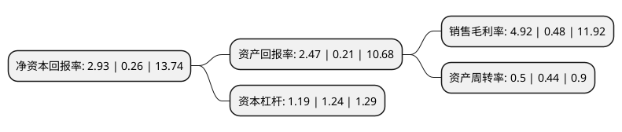

> 本页面由自动化程序生成于 2022年5月20日 01:20
> 内容可能存在错误，如有bug请提交issue至：https://github.com/Eroleice/doc-pi/issues
{.is-warning}

# 上市公司基本情况

## 基本资料

江苏聚杰微纤科技集团股份有限公司（以下简称“聚杰微纤”）成立于2000年05月26日，苏州市。于2020年03月12日在深交所创业板上市。

聚杰微纤注册资本9,947万元，公司专注于超细复合纤维面料及制成品的研发，生产，销售业务;主要产品包括超细纤维制成品，超细纤维仿皮面料，超细纤维功能面料以及超细纤维无尘洁净制品四个大类。以下是详细信息：

- 公司名称: 江苏聚杰微纤科技集团股份有限公司
- 股票代码: 300819.SZ
- 所在地: 江苏 - 苏州市
- 成立日期: 2000年05月26日
- 注册资本: 9,947万元
- 法定代表人: 仲鸿天
- 主营业务: 公司专注于超细复合纤维面料及制成品的研发，生产，销售业务;主要产品包括超细纤维制成品，超细纤维仿皮面料，超细纤维功能面料以及超细纤维无尘洁净制品四个大类
- 公司官网: www.jujie.com
- 公司介绍: 公司成立于2000年5月26日，是一家专业从事超细纤维系列面料、服装及家纺制品的研发、生产及销售于一体的集团企业，是超细纤维面料《超细涤锦纤维双面绒丝织物》FZ/T43038-2016的行业标准制定者，是目前国内生产超细纤维面料行业的龙头企业。产品的科技含量居国内细分行业领先地位。公司拥有强大的研发和创新能力，荣获工信部“全国工业品牌培育示范企业”、“中国超细纤维面料精品生产基地”、“江苏省高新科技企业”等荣誉。公司的研发中心被评为“江苏省企业技术中心”，并且成立了“江苏省博士后工作站”和“苏州市超细纤维产品工程技术研究中心”。公司注重绿色发展的理念，被中国纺织联合会评为“全国行业节能减排技术应用优秀示范单位”、“全国纺织行业绿色清洁优秀生产企业”等荣誉。连续多年获得中国长丝行业经济效益50强企业、吴江区百强企业、太湖新城纳税大户企业、社会责任奖企业等荣誉，2016年度获吴江区工业成长型十强企业。

## 股东及高管情况

上市公司第一大股东为苏州市聚杰投资有限公司，持股51,331,000股，占比51.6%，为上市公司实际控制人。

截至2022年03月31日，上市公司的前十大股东中，共有7名自然人股东，2名机构股东，1个产品账户，其中5%以上大股东共有4名。上市公司前十大股东明细如下：

> 截至2022年03月31日，上市公司前十大股东信息如下：

| 股东名称 | 持股数量（股） | 持股比例 |
| --- | --- | --- |
| 苏州市聚杰投资有限公司 | 51,331,000 | 51.6% |
| 苏州市聚杰君合投资合伙企业(有限合伙) | 5,831,000 | 5.86% |
| 仲鸿天 | 5,453,000 | 5.48% |
| 陆玉珍 | 5,453,000 | 5.48% |
| 仲湘聚 | 1,932,000 | 1.94% |
| 上海金浦新兴产业股权投资基金合伙企业(有限合伙) | 803,400 | 0.81% |
| 王栋诚 | 742,600 | 0.75% |
| 王明寰 | 571,700 | 0.57% |
| 陈楚冰 | 270,100 | 0.27% |
| 何成军 | 201,500 | 0.2% |

## 利润表分析

上市公司2021年总收入为4.8亿元，净利润为0.23亿元，实现盈利。

## 杜邦分析

> 数据列示周期：2021年 | 2020年 | 2019年
{.is-info}

上市公司的净资产收益率在近一年有所上升，上升幅度为1026.92%，其变化情况分解如下：
- 上市公司的销售毛利率在近一年上升了925%，可能是生产效率的提升、商品原材料价格下跌或商品价格的上涨所致。
- 上市公司的资产周转率在近一年上升了13.64%，可能是源自于更快的销售回款或库存管理效果提升。
- 上市公司的财务杠杆比率在近一年下降了-4.03%，可能是减少负债降低财务费用。

