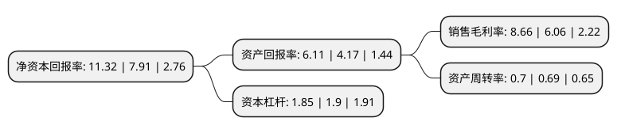

> 本页面由自动化程序生成于 2022年5月20日 01:24
> 内容可能存在错误，如有bug请提交issue至：https://github.com/Eroleice/doc-pi/issues
{.is-warning}

# 上市公司基本情况

## 基本资料

安徽皖维高新材料股份有限公司（以下简称“皖维高新”）成立于1997年05月23日，合肥市。于1997年05月28日在上交所主板上市。

皖维高新注册资本192,589.469万元，主营业务:化工，化纤，建材，新材料产品的生产与销售。主要产品:聚乙烯醇，高强高模PVA纤维，水泥，聚脂切片，陶瓷膜。以下是详细信息：

- 公司名称: 安徽皖维高新材料股份有限公司
- 股票代码: 600063.SH
- 所在地: 安徽 - 合肥市
- 成立日期: 1997年05月23日
- 注册资本: 192,589.469万元
- 法定代表人: 吴福胜
- 主营业务: 主营业务:化工，化纤，建材，新材料产品的生产与销售主要产品:聚乙烯醇，高强高模PVA纤维，水泥，聚脂切片，陶瓷膜
- 公司官网: www.wwgf.com.cn
- 公司介绍: 安徽皖维集团有限责任公司是安徽省国有资产监督管理委员会管辖的大型企业。前身是安徽省维尼纶厂，始建于1969年，为国家“四五”期间投资建设的重点项目。集团公司下辖6家子公司,核心子公司安徽皖维高新材料股份有限公司于1997年5月在上海证券交易所上市。皖维集团是安徽省重要的化工、化纤、建材、新材料联合制造企业，总资产逾100亿元，年销售收入超70亿元，进出口额超1亿美元。集团先后被评为国家级高新技术企业、安徽省创新型企业、火炬计划重点高新技术企业。核心子公司安徽皖维高新材料股份有限公司拥有国家级企业技术中心等五个研发机构，以及博士后工作站和技能大师工作室。公司瞄准PVA光学薄膜“卡脖子”项目，采取产学研合作等多种方式，加快技术研发，力争早日突破，全面推进传统产业转型升级，将皖维打造成PVA行业领军企业。皖维集团坐落于中国五大淡水湖之巢湖，北依京福、商合杭、合武、合宁高铁，合巢芜高速公路，南靠淮南铁路运输动脉，东近长江黄金水道，交通十分便捷。集团位于“一带一路”、长江经济带建设、长三角一体化发展和中部崛起四大国家战略交汇的重要节点，独具“左右逢源”的战略优势，更为皖维高质量发展创造无限广阔空间。

## 股东及高管情况

上市公司第一大股东为安徽皖维集团有限责任公司，持股591,965,118股，占比30.74%，为上市公司实际控制人。

截至2022年03月31日，上市公司的前十大股东中，共有6名自然人股东，1名机构股东，3个产品账户，其中5%以上大股东共有1名。上市公司前十大股东明细如下：

> 截至2022年03月31日，上市公司前十大股东信息如下：

| 股东名称 | 持股数量（股） | 持股比例 |
| --- | --- | --- |
| 安徽皖维集团有限责任公司 | 591,965,118 | 30.74% |
| 谢仁国 | 28,417,214 | 1.48% |
| 郑明 | 18,457,600 | 0.96% |
| 全国社保基金四一三组合 | 18,120,000 | 0.94% |
| 葛中伟 | 13,000,700 | 0.68% |
| 曹明 | 12,868,201 | 0.67% |
| 王纪勇 | 12,573,084 | 0.65% |
| 广发证券股份有限公司-中庚小盘价值股票型证券投资基金 | 10,230,682 | 0.53% |
| 谌建平 | 10,180,600 | 0.53% |
| 中国民生银行股份有限公司-东方红创新趋势混合型证券投资基金 | 7,783,600 | 0.4% |

## 利润表分析

上市公司2021年总收入为81.03亿元，净利润为9.77亿元，实现盈利。

## 杜邦分析

> 数据列示周期：2020年 | 2019年 | 2018年
{.is-info}

上市公司的净资产收益率在近一年有所上升，上升幅度为43.11%，其变化情况分解如下：
- 上市公司的销售毛利率在近一年上升了42.9%，可能是生产效率的提升、商品原材料价格下跌或商品价格的上涨所致。
- 上市公司的资产周转率在近一年上升了1.45%，可能是源自于更快的销售回款或库存管理效果提升。
- 上市公司的财务杠杆比率在近一年下降了-2.63%，可能是减少负债降低财务费用。

