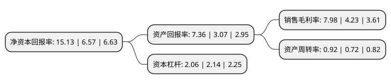

> 本页面由自动化程序生成于 2022年5月20日 01:26
> 内容可能存在错误，如有bug请提交issue至：https://github.com/Eroleice/doc-pi/issues
{.is-warning}

# 上市公司基本情况

## 基本资料

唐山三友化工股份有限公司（以下简称“三友化工”）成立于1999年12月28日，唐山市。于2003年06月18日在上交所主板上市。

三友化工注册资本206,434.945万元，主营业务:纯碱和氯化钙产品的生产与销售。以下是详细信息：

- 公司名称: 唐山三友化工股份有限公司
- 股票代码: 600409.SH
- 所在地: 河北 - 唐山市
- 成立日期: 1999年12月28日
- 注册资本: 206,434.945万元
- 法定代表人: 王春生
- 主营业务: 主营业务:纯碱和氯化钙产品的生产与销售
- 公司官网: www.sanyou-chem.com.cn
- 公司介绍: 公司是一家具有特色循环经济模式的集团型企业，是全国纯碱和化纤行业的知名企业。公司主导产品“三友”牌纯碱先后荣获“河北省免检产品”和“中国名牌”等多项荣誉称号，销售市场覆盖全国多个省、市、自治区，并远销亚、非、拉美、澳多个国家和地区。公司将遵循科学发展观，开发建设碱渣、盐泥压滤及综合治理项目，逐步走向资源节约型、环境友好型、可持续的发展道路。公司牢固树立科学发展观，认真落实五大发展理念，充分发扬“创业守成，事在人为”的企业精神，一直秉承“产品链接、工艺衔接、资源集约、产业集群”的循环经济发展理念，现已由成立之初单一纯碱业务发展成为具有“两碱一化”(纯碱、氯碱、化纤)特色循环经济模式的集团型企业，实现了从无机化工向有机化工、从基础化工向精细化工的转型升级。

## 股东及高管情况

上市公司第一大股东为唐山三友碱业(集团)有限公司，持股734,245,246股，占比35.5679%，为上市公司实际控制人。

截至2022年05月12日，上市公司的前十大股东中，共有1名自然人股东，4名机构股东，4个产品账户，1个海外主体，其中5%以上大股东共有3名。上市公司前十大股东明细如下：

> 截至2022年05月12日，上市公司前十大股东信息如下：

| 股东名称 | 持股数量（股） | 持股比例 |
| --- | --- | --- |
| 唐山三友碱业(集团)有限公司 | 734,245,246 | 35.5679% |
| 唐山三友碱业(集团)有限公司 | 732,697,246 | 35.49% |
| 唐山三友集团有限公司 | 167,257,721 | 8.1% |
| 香港中央结算有限公司(陆股通) | 26,750,864 | 1.3% |
| 唐山投资有限公司 | 19,958,816 | 0.97% |
| 前海人寿保险股份有限公司-分红保险产品 | 10,208,900 | 0.49% |
| 全国社保基金四零一组合 | 8,792,055 | 0.43% |
| 钟宝申 | 7,512,809 | 0.36% |
| 华夏人寿保险股份有限公司-万能保险产品 | 6,753,100 | 0.33% |
| 中国农业银行股份有限公司-中证500交易型开放式指数证券投资基金 | 5,966,361 | 0.29% |

## 利润表分析

上市公司2021年总收入为231.82亿元，净利润为18.49亿元，实现盈利。

## 杜邦分析

> 数据列示周期：2021年 | 2020年 | 2019年
{.is-info}

上市公司的净资产收益率在近一年有所上升，上升幅度为130.29%，其变化情况分解如下：
- 上市公司的销售毛利率在近一年上升了88.65%，可能是生产效率的提升、商品原材料价格下跌或商品价格的上涨所致。
- 上市公司的资产周转率在近一年上升了27.78%，可能是源自于更快的销售回款或库存管理效果提升。
- 上市公司的财务杠杆比率在近一年下降了-3.74%，可能是减少负债降低财务费用。

