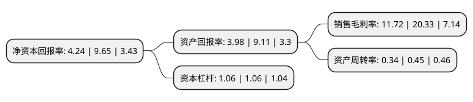

> 本页面由自动化程序生成于 2022年5月20日 01:27
> 内容可能存在错误，如有bug请提交issue至：https://github.com/Eroleice/doc-pi/issues
{.is-warning}

# 上市公司基本情况

## 基本资料

江苏江南高纤股份有限公司（以下简称“江南高纤”）成立于1996年11月25日，苏州市。于2003年11月27日在上交所主板上市。

江南高纤注册资本173,176.09万元，主要产品:化纤行业，涤纶毛条，涤纶短纤维。以下是详细信息：

- 公司名称: 江苏江南高纤股份有限公司
- 股票代码: 600527.SH
- 所在地: 江苏 - 苏州市
- 成立日期: 1996年11月25日
- 注册资本: 173,176.09万元
- 法定代表人: 陶冶
- 主营业务: 主要产品:化纤行业，涤纶毛条，涤纶短纤维
- 公司官网: www.jngx.cn
- 公司介绍: 公司是国内涤纶毛条龙头企业，是国家火炬计划重点高新技术企业,主要生产复合短纤维和涤纶毛条。目前，公司拥有19万吨复合短纤维和3.6万吨涤纶毛条的产能，主要产品有皮芯型复合短纤维、并列中空型复合短纤维、定岛海岛复合短纤维、高丽纶、细旦涤纶毛条、高收缩涤纶毛条、有色涤纶毛条、PTT涤纶毛条、富莱克毛条等，主要应于卫生材料、特种纸、高档皮革、毛纺等领域，产品畅销国内外，公司产品在国内外市场有较高的影响力和认知度。公司通过了ISO9001：2008标准质量管理体系认证和ISO14001：2004标准环境管理体系认证、OHSAS18001:2007标准职业健康安全管理体系认证。公司连续多年被评为全国守合同重信用企业、江苏省文明单位、江苏省优秀民营企业、江苏省民营企业纳税大户、AAA资信等级、江苏省“十五”技术进步先进企业，“牛头”商标被认定为中国驰名商标。

## 股东及高管情况

上市公司第一大股东为陶国平，持股390,792,006股，占比22.57%，**疑似为**上市公司实际控制人。

截至2022年03月31日，上市公司的前十大股东中，共有8名自然人股东，1名机构股东，1个海外主体，其中5%以上大股东共有3名。上市公司前十大股东明细如下：

> 未能通过持股比例判定出上市公司实际控制人（持股30%以上）
> 可能存在通过间接持股、联合持股、协议控制等方式拥有实际控制权的主体，具体请参考上市公司定期公告！
{.is-warning}

> 截至2022年03月31日，上市公司前十大股东信息如下：

| 股东名称 | 持股数量（股） | 持股比例 |
| --- | --- | --- |
| 陶国平 | 390,792,006 | 22.57% |
| 陶冶 | 126,680,000 | 7.32% |
| 叶金友 | 109,801,601 | 6.34% |
| 盛冬生 | 28,999,800 | 1.67% |
| 苏州市相城区黄埭镇集体资产经营公司 | 21,209,188 | 1.22% |
| 周永康 | 10,569,773 | 0.61% |
| 张秀 | 6,828,400 | 0.39% |
| 王新杰 | 6,140,500 | 0.35% |
| 赵燕燕 | 4,505,260 | 0.26% |
| 高华-汇丰-GOLDMAN, SACHS & CO.LLC | 4,060,820 | 0.23% |

## 利润表分析

上市公司2021年总收入为8.74亿元，净利润为1.02亿元，实现盈利。

## 杜邦分析

> 数据列示周期：2021年 | 2020年 | 2019年
{.is-info}

上市公司的净资产收益率在近一年有所下降，下降幅度为-56.06%，其变化情况分解如下：
- 上市公司的销售毛利率在近一年下降了-42.35%，可能是生产效率的下降、商品原材料价格上涨或商品价格的下跌所致。
- 上市公司的资产周转率在近一年下降了-24.44%，可能是源自于更慢的销售回款或库存管理效果下降。
- 上市公司的财务杠杆比率在近一年下降了0%，可能是减少负债降低财务费用。

