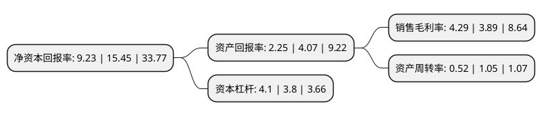

> 本页面由自动化程序生成于 2022年5月20日 01:29
> 内容可能存在错误，如有bug请提交issue至：https://github.com/Eroleice/doc-pi/issues
{.is-warning}

# 上市公司基本情况

## 基本资料

神马实业股份有限公司（以下简称“神马股份”）成立于1997年09月10日，平顶山市。于1994年01月06日在上交所主板上市。

神马股份注册资本104,417.574万元，主要产品:帘子布，工业丝以下是详细信息：

- 公司名称: 神马实业股份有限公司
- 股票代码: 600810.SH
- 所在地: 河南 - 平顶山市
- 成立日期: 1997年09月10日
- 注册资本: 104,417.574万元
- 法定代表人: 李本斌
- 主营业务: 主要产品:帘子布，工业丝
- 公司官网: www.shenma.com
- 公司介绍: 公司是以中国平煤神马集团为控股股东，以化工、化纤为主业的特大型企业，是中国平煤神马集团尼龙板块的管理平台。神马股份在产业结构上横跨化工、化纤两大行业，形成了以尼龙66盐和尼龙66盐中间产品、工程塑料、工业丝(帘子布)、BCF地毯丝、安全气囊丝等主导产品为支柱、以原辅材料及相关产品为依托的新产业格局。神马尼龙系列产品客户遍布欧洲、美洲、亚洲等40多个国家和地区，在国内外市场上享有盛誉。

## 股东及高管情况

上市公司第一大股东为中国平煤神马能源化工集团有限责任公司，持股613,461,879股，占比58.75%，为上市公司实际控制人。

截至2022年03月31日，上市公司的前十大股东中，共有7名自然人股东，1名机构股东，2个产品账户，其中5%以上大股东共有1名。上市公司前十大股东明细如下：

> 截至2022年03月31日，上市公司前十大股东信息如下：

| 股东名称 | 持股数量（股） | 持股比例 |
| --- | --- | --- |
| 中国平煤神马能源化工集团有限责任公司 | 613,461,879 | 58.75% |
| 李建锋 | 10,340,000 | 0.99% |
| 邓应尧 | 5,253,585 | 0.5% |
| 中国民生银行股份有限公司-东方红创新趋势混合型证券投资基金 | 5,128,300 | 0.49% |
| 何惠玲 | 4,749,061 | 0.45% |
| 解凤贤 | 3,480,000 | 0.33% |
| 杨永政 | 3,350,000 | 0.32% |
| 邱锦才 | 2,752,697 | 0.26% |
| 王丽人 | 2,735,978 | 0.26% |
| 财通基金-徐桂芹-财通基金玉泉893号单一资产管理计划 | 2,735,978 | 0.26% |

## 利润表分析

上市公司2021年总收入为134.15亿元，净利润为21.63亿元，实现盈利。

## 杜邦分析

> 数据列示周期：2020年 | 2019年 | 2018年
{.is-info}

上市公司的净资产收益率在近一年有所下降，下降幅度为-40.26%，其变化情况分解如下：
- 上市公司的销售毛利率在近一年上升了10.28%，可能是生产效率的提升、商品原材料价格下跌或商品价格的上涨所致。
- 上市公司的资产周转率在近一年下降了-50.48%，可能是源自于更慢的销售回款或库存管理效果下降。
- 上市公司的财务杠杆比率在近一年上升了7.89%，可能是增加负债扩大生产规模。

