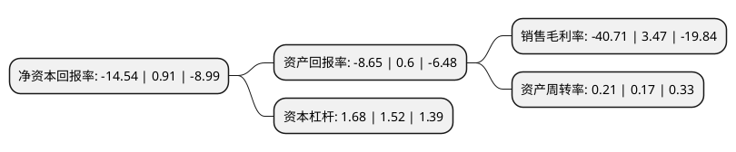

> 本页面由自动化程序生成于 2022年5月20日 01:29
> 内容可能存在错误，如有bug请提交issue至：https://github.com/Eroleice/doc-pi/issues
{.is-warning}

# 上市公司基本情况

## 基本资料

南京化纤股份有限公司（以下简称“南京化纤”）成立于1992年09月28日，南京市。于1996年03月08日在上交所主板上市。

南京化纤注册资本36,634.601万元，粘胶纤维和自来水的生产与经营。以下是详细信息：

- 公司名称: 南京化纤股份有限公司
- 股票代码: 600889.SH
- 所在地: 江苏 - 南京市
- 成立日期: 1992年09月28日
- 注册资本: 36,634.601万元
- 法定代表人: 丁明国
- 主营业务: 粘胶纤维和自来水的生产与经营
- 公司官网: www.ncfc.cn
- 公司介绍: 公司前身系于1964年建成投产的南京化学纤维厂。公司的主要业务是从事粘胶纤维和自来水的生产与经营。公司具有粘胶短纤8万吨/年、粘胶长丝2.0万吨/年的生产能力；同时还与奥地利兰精集团合资设立了兰精(南京)纤维有限公司，本公司持有兰精(南京)30%股权，是其参股股东。兰精(南京)拥有的粘胶短纤产能为16万吨/年。公司自来水厂位于南京市栖霞区燕子矶，拥有15万吨/日供水能力。公司从事粘胶纤维生产五十多年，积累了丰富的管理经验；粘胶纤维生产系统公用工程项目配套齐全，成本控制能力强；粘胶长丝产品品种多样、质量稳定，市场影响力较强；粘胶长丝、粘胶短纤规模配置合理，企业综合实力居于同行前列。

## 股东及高管情况

上市公司第一大股东为南京新工投资集团有限责任公司，持股129,709,768股，占比35.41%，为上市公司实际控制人。

截至2022年03月31日，上市公司的前十大股东中，共有4名自然人股东，4名机构股东，1个产品账户，1个海外主体，其中5%以上大股东共有3名。上市公司前十大股东明细如下：

> 截至2022年03月31日，上市公司前十大股东信息如下：

| 股东名称 | 持股数量（股） | 持股比例 |
| --- | --- | --- |
| 南京新工投资集团有限责任公司 | 129,709,768 | 35.41% |
| 南京轻纺产业(集团)有限公司 | 24,000,000 | 6.55% |
| 南京国资混改基金有限公司 | 23,584,905 | 6.44% |
| 金婷 | 5,721,808 | 1.56% |
| 金光华 | 4,401,851 | 1.2% |
| 南京纺织产业(集团)有限公司 | 1,464,946 | 0.4% |
| 昆明金鹰南亚购物中心有限公司 | 1,296,600 | 0.35% |
| MERRILL LYNCH INTERNATIONAL | 1,166,080 | 0.32% |
| 俞娥 | 1,126,900 | 0.31% |
| 吴怡 | 951,900 | 0.26% |

## 利润表分析

上市公司2021年总收入为4.69亿元，净利润为-1.92亿元，**未实现盈利**。

## 杜邦分析

> 数据列示周期：2021年 | 2020年 | 2019年
{.is-info}

上市公司的净资产收益率在近一年有所下降，下降幅度为-1697.8%，其变化情况分解如下：
- 上市公司的销售毛利率在近一年下降了-1273.2%，可能是生产效率的下降、商品原材料价格上涨或商品价格的下跌所致。
- 上市公司的资产周转率在近一年上升了23.53%，可能是源自于更快的销售回款或库存管理效果提升。
- 上市公司的财务杠杆比率在近一年上升了10.53%，可能是增加负债扩大生产规模。

