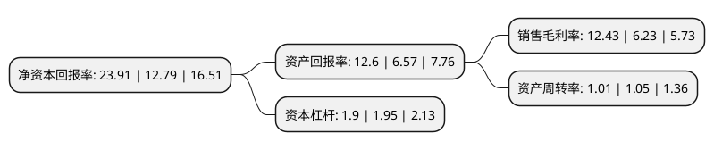

> 本页面由自动化程序生成于 2022年5月20日 01:30
> 内容可能存在错误，如有bug请提交issue至：https://github.com/Eroleice/doc-pi/issues
{.is-warning}

# 上市公司基本情况

## 基本资料

桐昆集团股份有限公司（以下简称“桐昆股份”）成立于1999年09月27日，嘉兴市。于2011年05月18日在上交所主板上市。

桐昆股份注册资本241,111.949万元，主营业务:民用涤纶长丝的研发，生产和销售。主要产品为POY，DTY和FDY等，POY，DTY和FDY等又可细分为差别化丝和常规丝(或者称为标准丝，普通丝)以下是详细信息：

- 公司名称: 桐昆集团股份有限公司
- 股票代码: 601233.SH
- 所在地: 浙江 - 嘉兴市
- 成立日期: 1999年09月27日
- 注册资本: 241,111.949万元
- 法定代表人: 陈士良
- 主营业务: 主营业务:民用涤纶长丝的研发，生产和销售主要产品为POY，DTY和FDY等，POY，DTY和FDY等又可细分为差别化丝和常规丝(或者称为标准丝，普通丝)
- 公司官网: www.zjtkgf.com
- 公司介绍: 公司是中国涤纶长丝制造行业的龙头企业，公司连续多年在中国涤纶长丝行业中销量排名第一。公司主营业务为民用涤纶长丝的研发、生产和销售。主要产品为差别化丝和常规丝(或者称为标准丝、普通丝)。公司建立了省级企业技术中心，公司为中国纺织工业协会、中国化学纤维工业协会及纺织产品开发中心认定的“国家新合纤产品开发基地”，公司承担的“功能性与差别化共聚酯关键技术开发与产业化项目”、主要参与的“大容量熔体直纺提质降耗及柔性化生产技术项目”均被列为国家科技支撑计划项目。“涤纶中速混纺型氨替纤维项目”、“高仿动物毛涤纶超柔超亮纤维项目”于被列入国家火炬计划项目。“年产40万吨POY及FDY差别化纤维生产线技术与装备研制”于被列为浙江省重大科技专项工业项目。同时，公司还参与了《清洁生产标准化纤行业(涤纶)》行业标准的制定和化纤长丝测试方法国家标准的修订工作。公司凭借稳健的经营，形成了优良的品牌信誉和突出的核心竞争力，为公司取得了多项资质和荣誉。

## 股东及高管情况

上市公司第一大股东为桐昆控股集团有限公司，持股464,908,884股，占比19.28%，**疑似为**上市公司实际控制人。

截至2022年03月31日，上市公司的前十大股东中，共有1名自然人股东，5名机构股东，3个产品账户，1个海外主体，其中5%以上大股东共有3名。上市公司前十大股东明细如下：

> 未能通过持股比例判定出上市公司实际控制人（持股30%以上）
> 可能存在通过间接持股、联合持股、协议控制等方式拥有实际控制权的主体，具体请参考上市公司定期公告！
{.is-warning}

> 截至2022年03月31日，上市公司前十大股东信息如下：

| 股东名称 | 持股数量（股） | 持股比例 |
| --- | --- | --- |
| 桐昆控股集团有限公司 | 464,908,884 | 19.28% |
| 嘉兴盛隆投资股份有限公司 | 225,207,402 | 9.34% |
| 浙江磊鑫实业股份有限公司 | 123,588,456 | 5.13% |
| 陈士良 | 106,647,464 | 4.42% |
| 香港中央结算有限公司(陆股通) | 69,303,792 | 2.87% |
| 上海浦东发展银行股份有限公司-广发高端制造股票型发起式证券投资基金 | 59,067,463 | 2.45% |
| 兴业银行股份有限公司-广发兴诚混合型证券投资基金 | 29,611,703 | 1.23% |
| 中国建设银行股份有限公司-广发诚享混合型证券投资基金 | 25,772,553 | 1.07% |
| 陕西省国际信托股份有限公司-陕国投·乐盈3号单一资金信托 | 21,032,812 | 0.87% |
| 浙江恒逸集团有限公司 | 19,520,220 | 0.81% |

## 利润表分析

上市公司2021年总收入为591.3亿元，净利润为73.52亿元，实现盈利。

## 杜邦分析

> 数据列示周期：2021年 | 2020年 | 2019年
{.is-info}

上市公司的净资产收益率在近一年有所上升，上升幅度为86.94%，其变化情况分解如下：
- 上市公司的销售毛利率在近一年上升了99.52%，可能是生产效率的提升、商品原材料价格下跌或商品价格的上涨所致。
- 上市公司的资产周转率在近一年下降了-3.81%，可能是源自于更慢的销售回款或库存管理效果下降。
- 上市公司的财务杠杆比率在近一年下降了-2.56%，可能是减少负债降低财务费用。

