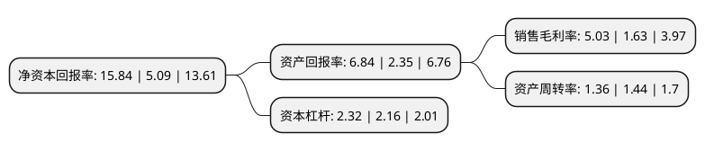

> 本页面由自动化程序生成于 2022年5月20日 01:33
> 内容可能存在错误，如有bug请提交issue至：https://github.com/Eroleice/doc-pi/issues
{.is-warning}

# 上市公司基本情况

## 基本资料

新凤鸣集团股份有限公司（以下简称“新凤鸣”）成立于2000年02月22日，嘉兴市。于2017年04月18日在上交所主板上市。

新凤鸣注册资本152,956.961万元，公司主营业务为民用涤纶长丝的研发，生产和销售，产品覆盖POY，FDY和DTY等多个系列400余个规格品种，主要应用于服装，家纺和产业用纺织品等领域。以下是详细信息：

- 公司名称: 新凤鸣集团股份有限公司
- 股票代码: 603225.SH
- 所在地: 浙江 - 嘉兴市
- 成立日期: 2000年02月22日
- 注册资本: 152,956.961万元
- 法定代表人: 庄耀中
- 主营业务: 公司主营业务为民用涤纶长丝的研发，生产和销售，产品覆盖POY，FDY和DTY等多个系列400余个规格品种，主要应用于服装，家纺和产业用纺织品等领域
- 公司官网: www.xinfengming.com
- 公司介绍: 公司创办于2000年，现已发展成为集聚酯、涤纶纺丝、加弹、进出口贸易为一体的现代大型股份制企业，下设中欣化纤、中驰化纤、中辰化纤、进出口公司等多家子公司，拥有省级技术研究院——浙江新凤鸣化纤研究院、院士工作站等科研机构。经过多年的努力，公司进一步完善了销售网络，销售区域已覆盖浙江、江苏、上海、广东、福建等十多个省市，另外“凤鸣”牌涤纶长丝还远销土耳其、埃及、韩国等多个国家和地区。公司先后被授予全国五一劳动奖状、全国非公企业“双强百佳党组织”、浙江省文明单位等荣誉称号，连续多年跻身“中国民企500强”、“中国制造业500强”、“浙江省百强企业”之列。

## 股东及高管情况

上市公司第一大股东为庄奎龙，持股337,521,813股，占比22.07%，**疑似为**上市公司实际控制人。

截至2022年03月31日，上市公司的前十大股东中，共有3名自然人股东，4名机构股东，3个产品账户，其中5%以上大股东共有5名。上市公司前十大股东明细如下：

> 未能通过持股比例判定出上市公司实际控制人（持股30%以上）
> 可能存在通过间接持股、联合持股、协议控制等方式拥有实际控制权的主体，具体请参考上市公司定期公告！
{.is-warning}

> 截至2022年03月31日，上市公司前十大股东信息如下：

| 股东名称 | 持股数量（股） | 持股比例 |
| --- | --- | --- |
| 庄奎龙 | 337,521,813 | 22.07% |
| 新凤鸣控股集团有限公司 | 235,693,920 | 15.41% |
| 桐乡市中聚投资有限公司 | 153,679,680 | 10.05% |
| 共青城胜帮投资管理有限公司-共青城胜帮凯米投资合伙企业(有限合伙) | 117,201,127 | 7.66% |
| 屈凤琪 | 101,716,738 | 6.65% |
| 桐乡市尚聚投资有限公司 | 35,703,360 | 2.33% |
| 上海浦东发展银行股份有限公司-广发高端制造股票型发起式证券投资基金 | 32,033,359 | 2.09% |
| 兴业银行股份有限公司-广发兴诚混合型证券投资基金 | 26,757,979 | 1.75% |
| 中国建设银行股份有限公司-广发诚享混合型证券投资基金 | 21,105,400 | 1.38% |
| 吴林根 | 20,874,065 | 1.36% |

## 利润表分析

上市公司2021年总收入为447.7亿元，净利润为22.53亿元，实现盈利。

## 杜邦分析

> 数据列示周期：2021年 | 2020年 | 2019年
{.is-info}

上市公司的净资产收益率在近一年有所上升，上升幅度为211.2%，其变化情况分解如下：
- 上市公司的销售毛利率在近一年上升了208.59%，可能是生产效率的提升、商品原材料价格下跌或商品价格的上涨所致。
- 上市公司的资产周转率在近一年下降了-5.56%，可能是源自于更慢的销售回款或库存管理效果下降。
- 上市公司的财务杠杆比率在近一年上升了7.41%，可能是增加负债扩大生产规模。

