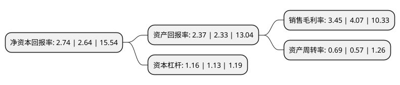

> 本页面由自动化程序生成于 2022年5月20日 01:33
> 内容可能存在错误，如有bug请提交issue至：https://github.com/Eroleice/doc-pi/issues
{.is-warning}

# 上市公司基本情况

## 基本资料

苏州龙杰特种纤维股份有限公司（以下简称“苏州龙杰”）成立于2003年06月11日，苏州市。于2019年01月17日在上交所主板上市。

苏州龙杰注册资本11,893.8万元，主营业务:专注于差别化涤纶长丝，PTT纤维等聚酯纤维长丝的研发，生产及销售。主要产品:仿麂皮纤维系列，仿皮草纤维系列，PTT纤维系列等核心特色产品。以下是详细信息：

- 公司名称: 苏州龙杰特种纤维股份有限公司
- 股票代码: 603332.SH
- 所在地: 江苏 - 苏州市
- 成立日期: 2003年06月11日
- 注册资本: 11,893.8万元
- 法定代表人: 席文杰
- 主营业务: 主营业务:专注于差别化涤纶长丝，PTT纤维等聚酯纤维长丝的研发，生产及销售主要产品:仿麂皮纤维系列，仿皮草纤维系列，PTT纤维系列等核心特色产品
- 公司官网: www.jslongjie.com
- 公司介绍: 公司是一家专注于研发、生产及销售差别化涤纶长丝、PTT纤维等差别化、新型聚酯纤维长丝研发、生产及销售的企业,产品主要应用于仿真动物皮毛、仿麂皮面料、记忆面料等服饰、家纺面料的生产。公司是国内少数掌握仿羊毛、仿兔毛等高/超仿真动物皮毛涤纶纤维生产技术的企业之一，仿麂皮纤维、仿皮草纤维、PTT纤维的规格种类丰富，在相应细分市场的市场占有率居于行业前列,公司主导或参与起草、修订了多项国家及行业技术标准，先后被评为江苏省高技术差别化纤维工程技术研究中心、国家复合纤维研发生产基地、中国精细化涤纶长丝研发和生产基地，荣获全国化纤行业“十二五”最具技术创新突破奖，并有多项产品获评为高新技术产品,目前公司获得多项国家发明专利及实用新型专利,公司凭借强大的研发创新实力，能够快速而又适时的调整产品类型，适应市场、引领市场，是聚酯纤维行业“专、精、特、强”(专业性强、高档次精品、特色产品、强竞争力)的代表性企业。

## 股东及高管情况

上市公司第一大股东为张家港市龙杰投资有限公司，持股61,600,000股，占比51.7917%，为上市公司实际控制人。

截至2022年03月31日，上市公司的前十大股东中，共有9名自然人股东，1名机构股东，其中5%以上大股东共有1名。上市公司前十大股东明细如下：

> 截至2022年03月31日，上市公司前十大股东信息如下：

| 股东名称 | 持股数量（股） | 持股比例 |
| --- | --- | --- |
| 张家港市龙杰投资有限公司 | 61,600,000 | 51.7917% |
| 席文杰 | 3,784,000 | 3.1815% |
| 席靓 | 3,784,000 | 3.1815% |
| 杨小芹 | 2,995,200 | 2.5183% |
| 何小林 | 1,584,000 | 1.3318% |
| 赵满才 | 1,285,300 | 1.0806% |
| 宋海云 | 1,121,200 | 0.9427% |
| 张延 | 1,093,800 | 0.9196% |
| 王建荣 | 1,020,000 | 0.8576% |
| 袁观香 | 850,050 | 0.7147% |

## 利润表分析

上市公司2021年总收入为10.72亿元，净利润为0.36亿元，实现盈利。

## 杜邦分析

> 数据列示周期：2021年 | 2020年 | 2019年
{.is-info}

上市公司的净资产收益率在近一年有所上升，上升幅度为3.79%，其变化情况分解如下：
- 上市公司的销售毛利率在近一年下降了-15.23%，可能是生产效率的下降、商品原材料价格上涨或商品价格的下跌所致。
- 上市公司的资产周转率在近一年上升了21.05%，可能是源自于更快的销售回款或库存管理效果提升。
- 上市公司的财务杠杆比率在近一年上升了2.65%，可能是增加负债扩大生产规模。

