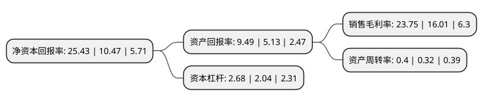

> 本页面由自动化程序生成于 2022年5月20日 01:39
> 内容可能存在错误，如有bug请提交issue至：https://github.com/Eroleice/doc-pi/issues
{.is-warning}

# 上市公司基本情况

## 基本资料

中复神鹰碳纤维股份有限公司（以下简称“中复神鹰”）成立于2006年03月02日，连云港市。于2022年04月06日在上交所科创板上市。

中复神鹰注册资本80,000万元，主营业务是专业从事碳纤维研发，生产和销售，对外销售主要产品为碳纤维。以下是详细信息：

- 公司名称: 中复神鹰碳纤维股份有限公司
- 股票代码: 688295.SH
- 所在地: 江苏 - 连云港市
- 成立日期: 2006年03月02日
- 注册资本: 80,000万元
- 法定代表人: 张国良
- 主营业务: 主营业务是专业从事碳纤维研发，生产和销售，对外销售主要产品为碳纤维
- 公司官网: www.zfsycf.com.cn
- 公司介绍: 公司是一家专业从事碳纤维研发、生产和销售的国家高新技术企业，对外销售主要产品为碳纤维。公司以“坚守初心匠心，追求卓越品质，引领科技进步，勇担国家责任，致力打造具有全球竞争力的世界一流碳纤维企业”为经营宗旨，通过多年自主研发掌握了碳纤维生产全流程核心技术，在国内率先突破了千吨级碳纤维原丝干喷湿纺工业化制造技术，建成了国内首条千吨级干喷湿纺碳纤维产业化生产线。2018年1月，公司“干喷湿纺千吨级高强/百吨级中模碳纤维产业化关键技术及应用”成果荣获2017年度国家科学技术进步一等奖。

## 股东及高管情况

上市公司第一大股东为中建材联合投资有限公司，持股298,399,282股，占比33.16%，为上市公司实际控制人。

截至2022年04月06日，上市公司的前十大股东中，共有7名机构股东，3个产品账户，其中5%以上大股东共有3名。上市公司前十大股东明细如下：

> 截至2022年04月06日，上市公司前十大股东信息如下：

| 股东名称 | 持股数量（股） | 持股比例 |
| --- | --- | --- |
| 中建材联合投资有限公司 | 298,399,282 | 33.16% |
| 连云港鹰游纺机集团有限公司 | 239,990,306 | 26.67% |
| 中国复合材料集团有限公司 | 216,959,854 | 24.11% |
| 连云港市工业投资集团有限公司 | 44,650,558 | 4.96% |
| 华金证券-招商银行-华金证券中复神鹰员工参与科创板战略配售集合资产管理计划 | 10,000,000 | 1.11% |
| 连云港市工投集团产业投资有限公司 | 2,239,060 | 0.25% |
| 浙江制造基金合伙企业(有限合伙) | 1,696,257 | 0.19% |
| 浙江金控投资有限公司 | 1,696,257 | 0.19% |
| 深创投红土股权投资管理(深圳)有限公司-深创投制造业转型升级新材料基金(有限合伙) | 1,696,257 | 0.19% |
| 上海汽车集团股份有限公司 | 1,696,257 | 0.19% |

## 利润表分析

上市公司2021年总收入为11.73亿元，净利润为2.78亿元，实现盈利。

## 杜邦分析

> 数据列示周期：2021年 | 2020年 | 2019年
{.is-info}

上市公司的净资产收益率在近一年有所上升，上升幅度为142.88%，其变化情况分解如下：
- 上市公司的销售毛利率在近一年上升了48.34%，可能是生产效率的提升、商品原材料价格下跌或商品价格的上涨所致。
- 上市公司的资产周转率在近一年上升了25%，可能是源自于更快的销售回款或库存管理效果提升。
- 上市公司的财务杠杆比率在近一年上升了31.37%，可能是增加负债扩大生产规模。

