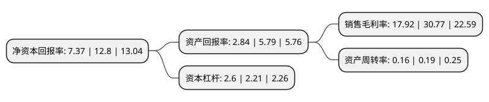

> 本页面由自动化程序生成于 2022年5月20日 01:01
> 内容可能存在错误，如有bug请提交issue至：https://github.com/Eroleice/doc-pi/issues
{.is-warning}

# 上市公司基本情况

## 基本资料

深圳市振业(集团)股份有限公司（以下简称“深振业A”）成立于1989年05月25日，深圳市。于1992年04月27日在深交所主板上市。

深振业A注册资本134,999.505万元，主要产品或提供的服务:提供商品住宅，以及提供物业租赁服务。以下是详细信息：

- 公司名称: 深圳市振业(集团)股份有限公司
- 股票代码: 000006.SZ
- 所在地: 广东 - 深圳市
- 成立日期: 1989年05月25日
- 注册资本: 134,999.505万元
- 法定代表人: 赵宏伟
- 主营业务: 主要产品或提供的服务:提供商品住宅，以及提供物业租赁服务
- 公司官网: www.zhenye.com
- 公司介绍: 公司是深圳市国有资产监督管理委员会直管的国有上市公司，公司以房地产开发经营为主营业务，具备国家一级开发资质。自公司成立以来，发展迅速，资产规模与开发规模不断壮大，先后开发了振业花园、振业大厦、星海名城、翠海花园、振业城、峦山谷、振业国际商务中心、惠阳振业城、西安振业·泊墅、南宁振业·青秀山1号、天津振业·城中央等代表性项目，产品类别涉及普通居民住宅、商用物业、Townhouse、别墅等多种类型。公司先后被授予中国房地产百强、中国上市公司百强，广东地产三十强、深圳房地产十强、深圳市首届发展循环经济十佳企业、特区建立30年——深圳企业文化建设功勋企业等称号。开发的星海名城、翠海花园分别荣获国家建设部颁发的“人居经典综合奖”、“规划环境金质奖”；振业城以A级住宅性能认证有史以来最高分899分顺利通过建设部3A终审，被列为“国家建筑节能示范小区”。

## 股东及高管情况

上市公司第一大股东为深圳市人民政府国有资产监督管理委员会，持股296,031,373股，占比21.93%，**疑似为**上市公司实际控制人。

截至2022年03月31日，上市公司的前十大股东中，共有6名自然人股东，2名机构股东，1个海外主体，1名其他股东，其中5%以上大股东共有2名。上市公司前十大股东明细如下：

> 未能通过持股比例判定出上市公司实际控制人（持股30%以上）
> 可能存在通过间接持股、联合持股、协议控制等方式拥有实际控制权的主体，具体请参考上市公司定期公告！
{.is-warning}

> 截至2022年03月31日，上市公司前十大股东信息如下：

| 股东名称 | 持股数量（股） | 持股比例 |
| --- | --- | --- |
| 深圳市人民政府国有资产监督管理委员会 | 296,031,373 | 21.93% |
| 深圳市资本运营集团有限公司 | 203,356,775 | 15.06% |
| 吴贵州 | 16,948,300 | 1.26% |
| 中央汇金资产管理有限责任公司 | 16,052,200 | 1.19% |
| 廖晔 | 8,700,000 | 0.64% |
| 张德锋 | 8,255,465 | 0.61% |
| 香港中央结算有限公司(陆股通) | 8,202,903 | 0.61% |
| 刘瑶 | 6,323,758 | 0.47% |
| 曾运龙 | 5,027,300 | 0.37% |
| 李寿荣 | 4,302,949 | 0.32% |

## 利润表分析

上市公司2021年总收入为30.88亿元，净利润为5.53亿元，实现盈利。

## 杜邦分析

> 数据列示周期：2021年 | 2020年 | 2019年
{.is-info}

上市公司的净资产收益率在近一年有所下降，下降幅度为-42.42%，其变化情况分解如下：
- 上市公司的销售毛利率在近一年下降了-41.76%，可能是生产效率的下降、商品原材料价格上涨或商品价格的下跌所致。
- 上市公司的资产周转率在近一年下降了-15.79%，可能是源自于更慢的销售回款或库存管理效果下降。
- 上市公司的财务杠杆比率在近一年上升了17.65%，可能是增加负债扩大生产规模。

