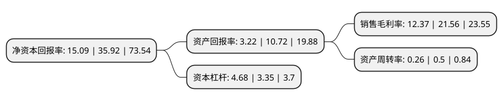

> 本页面由自动化程序生成于 2022年5月20日 01:01
> 内容可能存在错误，如有bug请提交issue至：https://github.com/Eroleice/doc-pi/issues
{.is-warning}

# 上市公司基本情况

## 基本资料

深圳市京基智农时代股份有限公司（以下简称“京基智农”）成立于1979年01月01日，深圳市。于1994年11月01日在深交所主板上市。

京基智农注册资本52,323.925万元，主要业务:饲料生产，房地产开发，自来水供应，养殖业，交通运输，商业贸易，房屋租赁。以下是详细信息：

- 公司名称: 深圳市京基智农时代股份有限公司
- 股票代码: 000048.SZ
- 所在地: 广东 - 深圳市
- 成立日期: 1979年01月01日
- 注册资本: 52,323.925万元
- 法定代表人: 熊伟
- 主营业务: 饲料生产，房地产开发，自来水供应，养殖业，交通运输，商业贸易，房屋租赁
- 公司官网: www.kingkeyzn.com
- 公司介绍: 公司前身为深圳市养鸡公司。公司发展至今已形成集低碳都市农业、公用事业、房地产、金融投资等多种产业于一体的多元化集团公司，业务内容包括：种猪、肉猪养殖与销售，种鸡、肉鸡养殖与销售，中高端品牌猪肉与鸡蛋等生鲜农产品销售，饲料生产与销售，交通运输，自来水供应，房地产开发，物业管理、金融投资等。公司养猪业以技术为依托，以种猪繁殖为中心，大力培育新品种，实现农业的科技化，在农业部种猪质量检测中心测定评比中多次获得好成绩，公司养猪场连年被评为健康与合格猪场、原种猪场合格单位、重点生猪养殖场、先进养猪企业。

## 股东及高管情况

上市公司第一大股东为京基集团有限公司，持股225,191,557股，占比43.04%，为上市公司实际控制人。

截至2022年03月31日，上市公司的前十大股东中，共有4名自然人股东，2名机构股东，4个产品账户，其中5%以上大股东共有2名。上市公司前十大股东明细如下：

> 截至2022年03月31日，上市公司前十大股东信息如下：

| 股东名称 | 持股数量（股） | 持股比例 |
| --- | --- | --- |
| 京基集团有限公司 | 225,191,557 | 43.04% |
| 深圳市京基时代实业有限公司 | 156,183,392 | 29.85% |
| 凌丽华 | 11,866,600 | 2.27% |
| 上海天倚道投资管理有限公司-天倚道天道10号私募证券投资基金 | 11,758,890 | 2.25% |
| 陈平 | 10,401,650 | 1.99% |
| 林炜豪 | 8,573,575 | 1.64% |
| 中国工商银行-广发策略优选混合型证券投资基金 | 4,257,341 | 0.81% |
| 深圳市券期资本管理有限公司-券期资本琨瑶8号私募证券投资基金 | 4,173,488 | 0.8% |
| 佘海燕 | 1,808,654 | 0.35% |
| 银华基金管理股份有限公司-社保基金1105组合 | 1,720,278 | 0.33% |

## 利润表分析

上市公司2021年总收入为32.21亿元，净利润为3.98亿元，实现盈利。

## 杜邦分析

> 数据列示周期：2021年 | 2020年 | 2019年
{.is-info}

上市公司的净资产收益率在近一年有所下降，下降幅度为-57.99%，其变化情况分解如下：
- 上市公司的销售毛利率在近一年下降了-42.63%，可能是生产效率的下降、商品原材料价格上涨或商品价格的下跌所致。
- 上市公司的资产周转率在近一年下降了-48%，可能是源自于更慢的销售回款或库存管理效果下降。
- 上市公司的财务杠杆比率在近一年上升了39.7%，可能是增加负债扩大生产规模。

