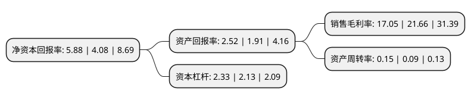

> 本页面由自动化程序生成于 2022年5月20日 01:02
> 内容可能存在错误，如有bug请提交issue至：https://github.com/Eroleice/doc-pi/issues
{.is-warning}

# 上市公司基本情况

## 基本资料

重庆渝开发股份有限公司（以下简称“渝开发”）成立于1992年09月08日，重庆市。于1993年07月12日在深交所主板上市。

渝开发注册资本84,377.097万元，主要业务:房地产开发，代理土地整治。以下是详细信息：

- 公司名称: 重庆渝开发股份有限公司
- 股票代码: 000514.SZ
- 所在地: 重庆 - 重庆市
- 成立日期: 1992年09月08日
- 注册资本: 84,377.097万元
- 法定代表人: 艾云
- 主营业务: 房地产开发，代理土地整治
- 公司官网: www.cqukf.com
- 公司介绍: 公司是重庆市最早的一家房地产开发企业，具有一级开发资质。经过多年发展，公司已发展成为集房地产开发、市政资产经营、会展经营、酒店经营为一身的多元化公司。近年来，开发建设了国汇中心、渝开发·新干线大厦、上城时代、祈年悦城、橄榄郡等精品项目，代理建设西永和南岸茶园两个公租房项目。公司曾先后获评四届(首届、第五届、第六届、第七届)“重庆市房地产开发企业五十强”、“中国证券市场年会金凤凰奖”、“金鹰奖”、“中国房地产诚信企业”等荣誉。在大力发展房地产主营业务的同时，公司还着力拓展会展经营和物业管理资产经营等多元化产业，并取得丰硕成果。

## 股东及高管情况

上市公司第一大股东为重庆市城市建设投资(集团)有限公司，持股533,149,099股，占比63.19%，为上市公司实际控制人。

截至2022年03月31日，上市公司的前十大股东中，共有6名自然人股东，2名机构股东，2个海外主体，其中5%以上大股东共有1名。上市公司前十大股东明细如下：

> 截至2022年03月31日，上市公司前十大股东信息如下：

| 股东名称 | 持股数量（股） | 持股比例 |
| --- | --- | --- |
| 重庆市城市建设投资(集团)有限公司 | 533,149,099 | 63.19% |
| 张建飞 | 3,996,800 | 0.47% |
| 陈海华 | 3,565,800 | 0.42% |
| 徐晓 | 3,000,000 | 0.36% |
| 丁雅明 | 2,550,800 | 0.3% |
| 神威医药科技股份有限公司 | 2,550,000 | 0.3% |
| 刘炜 | 2,000,000 | 0.24% |
| 裴红伟 | 1,988,300 | 0.24% |
| MORGAN STANLE & CO. INTERN PLC. | 1,728,836 | 0.2% |
| UBS AG | 1,423,452 | 0.17% |

## 利润表分析

上市公司2021年总收入为11.86亿元，净利润为2.02亿元，实现盈利。

## 杜邦分析

> 数据列示周期：2021年 | 2020年 | 2019年
{.is-info}

上市公司的净资产收益率在近一年有所上升，上升幅度为44.12%，其变化情况分解如下：
- 上市公司的销售毛利率在近一年下降了-21.28%，可能是生产效率的下降、商品原材料价格上涨或商品价格的下跌所致。
- 上市公司的资产周转率在近一年上升了66.67%，可能是源自于更快的销售回款或库存管理效果提升。
- 上市公司的财务杠杆比率在近一年上升了9.39%，可能是增加负债扩大生产规模。

