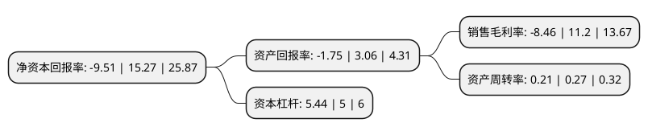

> 本页面由自动化程序生成于 2022年5月20日 01:02
> 内容可能存在错误，如有bug请提交issue至：https://github.com/Eroleice/doc-pi/issues
{.is-warning}

# 上市公司基本情况

## 基本资料

天津广宇发展股份有限公司（以下简称“广宇发展”）成立于1986年03月05日，天津市。于1993年12月10日在深交所主板上市。

广宇发展注册资本186,252.072万元，主营业务:房地产开发。以下是详细信息：

- 公司名称: 天津广宇发展股份有限公司
- 股票代码: 000537.SZ
- 所在地: 天津 - 天津市
- 成立日期: 1986年03月05日
- 注册资本: 186,252.072万元
- 法定代表人: 粘建军
- 主营业务: 主营业务:房地产开发
- 公司官网: www.gyfz000537.com
- 公司介绍: 公司主营业务为房地产开发与销售，经营模式以自主开发销售为主，同时创新引入渠道总包模式，暨引入专业供方，以业绩为考核，积极整合所在区域内各分销及二手房中介公司，实现销售渠道的深度覆盖、广度提升。公司业务板块主要集中于住宅地产开发。公司住宅地产开发业务，根据土地规划情况以及当地区域市场将主要商品住宅分为高层、别墅和洋房，并通过子公司在重庆、东莞、青岛等城市进行开发、建设和销售。公司十多年来一直深耕巴蜀大地，致力于四川、重庆片区的房地产项目开发，拥有丰富的房地产开发经验和稳定有创造力的项目开发团队，公司市场定位清晰、明确，与国际著名的企业管理机构进行过多次战略合作，逐步形成了专业化、标准化、规范化的开发管理模式。

## 股东及高管情况

上市公司第一大股东为鲁能集团有限公司，持股1,417,909,637股，占比76.13%，为上市公司实际控制人。

截至2022年03月31日，上市公司的前十大股东中，共有2名自然人股东，1名机构股东，6个产品账户，1个海外主体，其中5%以上大股东共有1名。上市公司前十大股东明细如下：

> 截至2022年03月31日，上市公司前十大股东信息如下：

| 股东名称 | 持股数量（股） | 持股比例 |
| --- | --- | --- |
| 鲁能集团有限公司 | 1,417,909,637 | 76.13% |
| 香港中央结算有限公司(陆股通) | 13,578,675 | 0.73% |
| 中国工商银行股份有限公司-申万菱信新经济混合型证券投资基金 | 10,669,600 | 0.57% |
| 交通银行股份有限公司-永赢长远价值混合型证券投资基金 | 9,435,600 | 0.51% |
| 招商银行股份有限公司-工银瑞信新金融股票型证券投资基金 | 9,016,738 | 0.48% |
| 中国建设银行股份有限公司-华安国企改革主题灵活配置混合型证券投资基金 | 7,348,800 | 0.39% |
| 汪向东 | 5,986,918 | 0.32% |
| 招商银行股份有限公司-工银瑞信圆兴混合型证券投资基金 | 5,599,913 | 0.3% |
| 魏巍 | 4,609,464 | 0.25% |
| 上海浦东发展银行股份有限公司-永赢消费主题灵活配置混合型证券投资基金 | 4,412,571 | 0.24% |

## 利润表分析

上市公司2021年总收入为162.35亿元，净利润为-13.74亿元，**未实现盈利**。

## 杜邦分析

> 数据列示周期：2021年 | 2020年 | 2019年
{.is-info}

上市公司的净资产收益率在近一年有所下降，下降幅度为-162.28%，其变化情况分解如下：
- 上市公司的销售毛利率在近一年下降了-175.54%，可能是生产效率的下降、商品原材料价格上涨或商品价格的下跌所致。
- 上市公司的资产周转率在近一年下降了-22.22%，可能是源自于更慢的销售回款或库存管理效果下降。
- 上市公司的财务杠杆比率在近一年上升了8.8%，可能是增加负债扩大生产规模。

