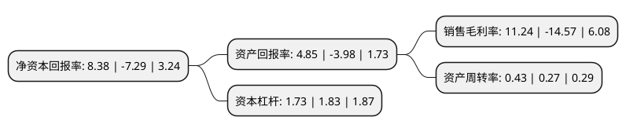

> 本页面由自动化程序生成于 2022年5月20日 01:02
> 内容可能存在错误，如有bug请提交issue至：https://github.com/Eroleice/doc-pi/issues
{.is-warning}

# 上市公司基本情况

## 基本资料

东莞宏远工业区股份有限公司（以下简称“粤宏远A”）成立于1992年05月08日，东莞市。于1994年08月15日在深交所主板上市。

粤宏远A注册资本63,828.06万元，主要业务:房地产和工业区开发，原煤开采及销售，再生铅业务以下是详细信息：

- 公司名称: 东莞宏远工业区股份有限公司
- 股票代码: 000573.SZ
- 所在地: 广东 - 东莞市
- 成立日期: 1992年05月08日
- 注册资本: 63,828.06万元
- 法定代表人: 周明轩
- 主营业务: 房地产和工业区开发，原煤开采及销售，再生铅业务
- 公司官网: www.winnerway.com.cn
- 公司介绍: 公司是东莞市第一家上市公司，是一家以房地产开发为主营业务，同时配套水电工程建设，以及经营工业区厂房租赁、原煤开采与销售，在循环经济中回收与利用铅蓄电池、含铅废物，生产环保再生铅的上市公司。公司精耕东莞房地产市场多年，历年来推出宏远花园、金丰花园，江南世家、江南雅筑、江南第一城，活力康城、康城假日，御庭山、帝庭山等一系列品质优良、具有较高知名度的房地产项目，连续多年被评为房地产综合开发先进企业单位。公司下属控股公司英德市新裕有色金属再生资源制品有限公司持有由广东省环境保护厅核发的《危险废物经营许可证》，主要经营含铅废物回收利用和再生铅生产，是目前广东省内合法产能最大的再生铅企业。

## 股东及高管情况

上市公司第一大股东为广东宏远集团有限公司，持股127,359,707股，占比19.95%，**疑似为**上市公司实际控制人。

截至2022年03月31日，上市公司的前十大股东中，共有6名自然人股东，3名机构股东，1个产品账户，其中5%以上大股东共有1名。上市公司前十大股东明细如下：

> 未能通过持股比例判定出上市公司实际控制人（持股30%以上）
> 可能存在通过间接持股、联合持股、协议控制等方式拥有实际控制权的主体，具体请参考上市公司定期公告！
{.is-warning}

> 截至2022年03月31日，上市公司前十大股东信息如下：

| 股东名称 | 持股数量（股） | 持股比例 |
| --- | --- | --- |
| 广东宏远集团有限公司 | 127,359,707 | 19.95% |
| 方国宝 | 20,847,001 | 3.27% |
| 东莞市振兴工贸发展有限公司 | 19,780,079 | 3.1% |
| 陆生华 | 15,303,606 | 2.4% |
| 北京汐合精英投资有限公司-汐合AI策略1号私募证券投资基金 | 3,594,600 | 0.56% |
| 刘伟权 | 3,477,356 | 0.54% |
| 张林 | 3,360,000 | 0.53% |
| 王强 | 3,080,000 | 0.48% |
| 华泰证券股份有限公司 | 3,073,370 | 0.48% |
| 张林1 | 2,939,900 | 0.46% |

## 利润表分析

上市公司2021年总收入为12.11亿元，净利润为1.36亿元，实现盈利。

## 杜邦分析

> 数据列示周期：2021年 | 2020年 | 2019年
{.is-info}

上市公司的净资产收益率在近一年有所下降，下降幅度为-214.95%，其变化情况分解如下：
- 上市公司的销售毛利率在近一年下降了-177.14%，可能是生产效率的下降、商品原材料价格上涨或商品价格的下跌所致。
- 上市公司的资产周转率在近一年上升了59.26%，可能是源自于更快的销售回款或库存管理效果提升。
- 上市公司的财务杠杆比率在近一年下降了-5.46%，可能是减少负债降低财务费用。

