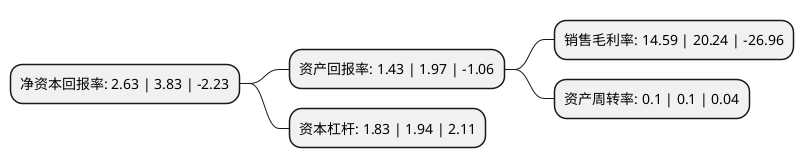

> 本页面由自动化程序生成于 2022年5月20日 01:02
> 内容可能存在错误，如有bug请提交issue至：https://github.com/Eroleice/doc-pi/issues
{.is-warning}

# 上市公司基本情况

## 基本资料

阳光新业地产股份有限公司（以下简称“阳光股份”）成立于1996年06月07日，南宁市。于1996年09月19日在深交所主板上市。

阳光股份注册资本74,991.331万元，主要业务:房地产开发销售。以下是详细信息：

- 公司名称: 阳光新业地产股份有限公司
- 股票代码: 000608.SZ
- 所在地: 广西 - 南宁市
- 成立日期: 1996年06月07日
- 注册资本: 74,991.331万元
- 法定代表人: 周磊
- 主营业务: 房地产开发销售
- 公司官网: www.yangguangxinye.com
- 公司介绍: 公司1997年实现借壳上市，2006年与新加坡政府产业投资公司(GIC RE)旗下Reco Shine公司签订战略投资协议，成为国内第一家引进国际战略投资的A股上市地产公司。公司主营业务为投资性房产出租与资产管理服务，房地产开发与销售。公司自2007年引入GIC转型商业地产以来，通过运营管理约30个社区购物中心，已经在国内商业地产领域形成了一定的知名度及品牌效应。公司于2006年开始涉及商业地产，近10年来，在中国主要一二线城市完成了超过30个项目的招商及运营，公司已建立起以京津沪区域为重点，同时在全国范围发展和布局的业务规模。

## 股东及高管情况

上市公司第一大股东为京基集团有限公司，持股224,771,000股，占比29.97%，**疑似为**上市公司实际控制人。

截至2022年03月31日，上市公司的前十大股东中，共有5名自然人股东，4名机构股东，1个产品账户，其中5%以上大股东共有2名。上市公司前十大股东明细如下：

> 未能通过持股比例判定出上市公司实际控制人（持股30%以上）
> 可能存在通过间接持股、联合持股、协议控制等方式拥有实际控制权的主体，具体请参考上市公司定期公告！
{.is-warning}

> 截至2022年03月31日，上市公司前十大股东信息如下：

| 股东名称 | 持股数量（股） | 持股比例 |
| --- | --- | --- |
| 京基集团有限公司 | 224,771,000 | 29.97% |
| 京基集团有限公司 | 224,771,000 | 29.97% |
| 上海永磐实业有限公司 | 37,491,838 | 5% |
| 上海天倚道投资管理有限公司-天倚道励新11号私募证券投资基金 | 36,649,000 | 4.89% |
| 周增希 | 23,138,973 | 3.09% |
| 伍美成 | 8,471,201 | 1.13% |
| 北京燕赵房地产开发有限公司 | 7,886,352 | 1.05% |
| 陈焕杰 | 6,781,430 | 0.9% |
| 张音 | 6,000,000 | 0.8% |
| 孙金华 | 5,742,800 | 0.77% |

## 利润表分析

上市公司2021年总收入为5.67亿元，净利润为0.82亿元，实现盈利。

## 杜邦分析

> 数据列示周期：2021年 | 2020年 | 2019年
{.is-info}

上市公司的净资产收益率在近一年有所下降，下降幅度为-31.33%，其变化情况分解如下：
- 上市公司的销售毛利率在近一年下降了-27.92%，可能是生产效率的下降、商品原材料价格上涨或商品价格的下跌所致。
- 上市公司的资产周转率在近一年下降了0%，可能是源自于更慢的销售回款或库存管理效果下降。
- 上市公司的财务杠杆比率在近一年下降了-5.67%，可能是减少负债降低财务费用。

