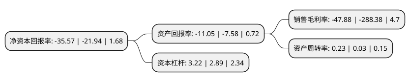

> 本页面由自动化程序生成于 2022年5月20日 01:02
> 内容可能存在错误，如有bug请提交issue至：https://github.com/Eroleice/doc-pi/issues
{.is-warning}

# 上市公司基本情况

## 基本资料

北京中迪投资股份有限公司（以下简称“中迪投资”）成立于1993年08月02日，北京市。于1996年10月10日在深交所主板上市。

中迪投资注册资本29,926.552万元，主营业务:以土地一级开发业务为主，同时兼顾其他行业的开拓和投资。以下是详细信息：

- 公司名称: 北京中迪投资股份有限公司
- 股票代码: 000609.SZ
- 所在地: 北京 - 北京市
- 成立日期: 1993年08月02日
- 注册资本: 29,926.552万元
- 法定代表人: 张孝诚
- 主营业务: 主营业务:以土地一级开发业务为主，同时兼顾其他行业的开拓和投资
- 公司官网: www.zdinvest.com
- 公司介绍: 公司原来是北京市科委认定的大型高新技术企业，近年经产业结构调整后，公司业务以房地产综合开发为主，同时向着现代快餐连锁经营方向迅速发展，形成符合自身发展要求、互补性强且具有稳定盈利能力的主营业务体系。数年来已有多块土地完成整理并成功上市，地价屡创新高，为公司及合作伙伴创造了丰厚的利润回报。在土地一级开发业务顺利进行的基础上，公司也积极向传统的房地产二级开发领域进军，以实现房地产一、二级开发的联动，搭建起具有公司自身特色的房地产综合开发体系。与房地产综合开发业务推进的同时，公司将另一个业务重心放在了现代快餐连锁经营行业上，以期能够与已有的房地产业务形成有效的互补。

## 股东及高管情况

上市公司第一大股东为广东润鸿富创科技中心(有限合伙)，持股71,144,800股，占比23.77%，**疑似为**上市公司实际控制人。

截至2022年03月31日，上市公司的前十大股东中，共有7名自然人股东，3名机构股东，其中5%以上大股东共有1名。上市公司前十大股东明细如下：

> 未能通过持股比例判定出上市公司实际控制人（持股30%以上）
> 可能存在通过间接持股、联合持股、协议控制等方式拥有实际控制权的主体，具体请参考上市公司定期公告！
{.is-warning}

> 截至2022年03月31日，上市公司前十大股东信息如下：

| 股东名称 | 持股数量（股） | 持股比例 |
| --- | --- | --- |
| 广东润鸿富创科技中心(有限合伙) | 71,144,800 | 23.77% |
| 北京燕化联营开发有限公司 | 13,613,503 | 4.55% |
| 刘杰 | 8,575,079 | 2.87% |
| 中国石化集团北京燕山石油化工有限公司 | 7,176,000 | 2.4% |
| 刘文胜 | 3,152,151 | 1.05% |
| 来俊朋 | 2,507,100 | 0.84% |
| 黄建康 | 2,293,010 | 0.77% |
| 李希泉 | 2,202,042 | 0.74% |
| 解苓玲 | 1,970,113 | 0.66% |
| 钟祎玲 | 1,750,800 | 0.59% |

## 利润表分析

上市公司2021年总收入为7.84亿元，净利润为-3.76亿元，**未实现盈利**。

## 杜邦分析

> 数据列示周期：2021年 | 2020年 | 2019年
{.is-info}

上市公司的净资产收益率在近一年有所上升，上升幅度为62.12%，其变化情况分解如下：
- 上市公司的销售毛利率在近一年下降了-83.4%，可能是生产效率的下降、商品原材料价格上涨或商品价格的下跌所致。
- 上市公司的资产周转率在近一年上升了666.67%，可能是源自于更快的销售回款或库存管理效果提升。
- 上市公司的财务杠杆比率在近一年上升了11.42%，可能是增加负债扩大生产规模。

