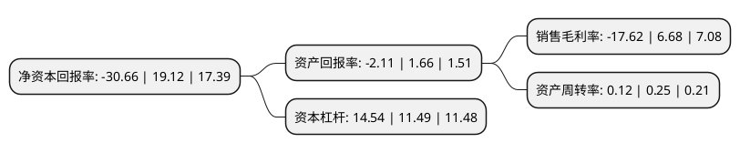

> 本页面由自动化程序生成于 2022年5月20日 01:03
> 内容可能存在错误，如有bug请提交issue至：https://github.com/Eroleice/doc-pi/issues
{.is-warning}

# 上市公司基本情况

## 基本资料

阳光城集团股份有限公司（以下简称“阳光城”）成立于1991年08月12日，福州市。于1996年12月18日在深交所主板上市。

阳光城注册资本414,038.295万元，主要业务:房地产开发，种业经营和商品贸易。以下是详细信息：

- 公司名称: 阳光城集团股份有限公司
- 股票代码: 000671.SZ
- 所在地: 福建 - 福州市
- 成立日期: 1991年08月12日
- 注册资本: 414,038.295万元
- 法定代表人: 林腾蛟
- 主营业务: 房地产开发，种业经营和商品贸易
- 公司官网: www.yango.com.cn
- 公司介绍: 公司是世界500强阳光控股投资，以房地产开发为主业的全国化品牌企业，业务涵盖地产开发、商业运营、物业服务三大领域。以“缔造品质生活”为企业使命，以“最受尊敬的成长性房地产企业”为愿景，阳光城集团定位“高成长性精品地产运营商”，通过“精准投资、高效运营、适销产品”三大核心竞争策略，贯彻开放、合作、共赢理念，稳健运营、持续进取，努力实现有质量的增长。公司在坚持地产主业的同时，灵活运用金融创新平台，实现中国领先的地产金融战略合作，在住宅地产的基础上，阳光城集团不断拓展商业地产、城市更新、存量资产、产业地产等高价值版图，并已形成独特的商业地产战略及成熟的运营团队，“阳光小镇”、“阳光天地”及“阳光荟”三大产品线日趋成熟，为公司实现聚合发展奠定了基础。

## 股东及高管情况

上市公司第一大股东为福建阳光集团有限公司，持股661,336,264股，占比15.97%，**疑似为**上市公司实际控制人。

截至2022年03月31日，上市公司的前十大股东中，共有3名自然人股东，6名机构股东，1个海外主体，其中5%以上大股东共有4名。上市公司前十大股东明细如下：

> 未能通过持股比例判定出上市公司实际控制人（持股30%以上）
> 可能存在通过间接持股、联合持股、协议控制等方式拥有实际控制权的主体，具体请参考上市公司定期公告！
{.is-warning}

> 截至2022年03月31日，上市公司前十大股东信息如下：

| 股东名称 | 持股数量（股） | 持股比例 |
| --- | --- | --- |
| 福建阳光集团有限公司 | 661,336,264 | 15.97% |
| 东方信隆资产管理有限公司 | 600,893,047 | 14.51% |
| 福建康田实业集团有限公司 | 365,089,223 | 8.82% |
| 沧州泰禾建材有限公司 | 306,727,826 | 7.41% |
| 顾伯江 | 68,707,724 | 1.66% |
| 卢丽静 | 50,475,919 | 1.22% |
| 中国证券金融股份有限公司 | 49,737,881 | 1.2% |
| 余冬娟 | 45,391,233 | 1.1% |
| 香港中央结算有限公司(陆股通) | 41,810,880 | 1.01% |
| 泰康人寿保险有限责任公司-分红-团体分红-019L-FH001深 | 41,404,000 | 1% |

## 杜邦分析

> 数据列示周期：2021年 | 2020年 | 2019年
{.is-info}

上市公司的净资产收益率在近一年有所下降，下降幅度为-260.36%，其变化情况分解如下：
- 上市公司的销售毛利率在近一年下降了-363.77%，可能是生产效率的下降、商品原材料价格上涨或商品价格的下跌所致。
- 上市公司的资产周转率在近一年下降了-52%，可能是源自于更慢的销售回款或库存管理效果下降。
- 上市公司的财务杠杆比率在近一年上升了26.54%，可能是增加负债扩大生产规模。

