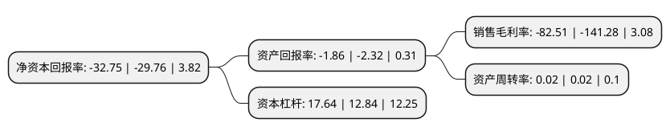

> 本页面由自动化程序生成于 2022年5月20日 01:03
> 内容可能存在错误，如有bug请提交issue至：https://github.com/Eroleice/doc-pi/issues
{.is-warning}

# 上市公司基本情况

## 基本资料

泰禾集团股份有限公司（以下简称“ST泰禾”）成立于1992年12月29日，三明市。于1997年07月04日在深交所主板上市。

ST泰禾注册资本248,890.144万元，主要业务:农药，房地产以下是详细信息：

- 公司名称: 泰禾集团股份有限公司
- 股票代码: 000732.SZ
- 所在地: 福建 - 三明市
- 成立日期: 1992年12月29日
- 注册资本: 248,890.144万元
- 法定代表人: 黄其森
- 主营业务: 农药，房地产
- 公司官网: www.tahoecn.com
- 公司介绍: 公司是一家在地产、金融、文化等领域多元发展的大型知名上市公司。公司主要从事住宅地产和商业地产的开发。以泰禾“院子”、“大院”系列为核心品牌的高端住宅地产产品，以“泰禾广场”“泰禾新天地”“中央广场”为核心品牌的商业地产产品，在全国具有一定的品牌影响力。公司坚持“扎根福建本土，深耕一线城市”的房地产战略布局，项目主要围绕着以北京为中心的京津冀、以上海为中心的长三角、以广深为中心的珠三角以及福建的福州、厦门等主要经济发达区域，并逐步辐射二线省会及核心城市。

## 股东及高管情况

上市公司第一大股东为泰禾投资集团有限公司，持股1,139,424,336股，占比45.78%，为上市公司实际控制人。

截至2022年03月31日，上市公司的前十大股东中，共有7名自然人股东，2名机构股东，1个产品账户，其中5%以上大股东共有4名。上市公司前十大股东明细如下：

> 截至2022年03月31日，上市公司前十大股东信息如下：

| 股东名称 | 持股数量（股） | 持股比例 |
| --- | --- | --- |
| 泰禾投资集团有限公司 | 1,139,424,336 | 45.78% |
| 泰禾投资集团有限公司 | 1,051,384,336 | 42.24% |
| 叶荔 | 300,000,000 | 12.05% |
| 叶荔 | 300,000,000 | 12.05% |
| 蔡炜宇 | 7,099,400 | 0.29% |
| 徐文星 | 7,000,154 | 0.28% |
| 王飞 | 6,342,600 | 0.25% |
| 鲁晏余 | 5,950,000 | 0.24% |
| 张新姣 | 5,764,331 | 0.23% |
| 中国工商银行股份有限公司-南方中证全指房地产交易型开放式指数证券投资基金 | 4,588,000 | 0.18% |

## 杜邦分析

> 数据列示周期：2021年 | 2020年 | 2019年
{.is-info}

上市公司的净资产收益率在近一年有所上升，上升幅度为10.05%，其变化情况分解如下：
- 上市公司的销售毛利率在近一年下降了-41.6%，可能是生产效率的下降、商品原材料价格上涨或商品价格的下跌所致。
- 上市公司的资产周转率在近一年下降了0%，可能是源自于更慢的销售回款或库存管理效果下降。
- 上市公司的财务杠杆比率在近一年上升了37.38%，可能是增加负债扩大生产规模。

