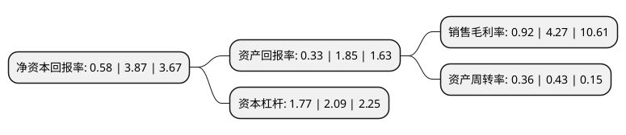

> 本页面由自动化程序生成于 2022年5月20日 01:04
> 内容可能存在错误，如有bug请提交issue至：https://github.com/Eroleice/doc-pi/issues
{.is-warning}

# 上市公司基本情况

## 基本资料

三湘印象股份有限公司（以下简称“三湘印象”）成立于1994年01月20日，上海市。于1997年09月25日在深交所主板上市。

三湘印象注册资本122,520.816万元，主营业务:投资兴办实业;国内贸易(不含专营，专控，专卖商品)，从事房地产开发经营;资产管理和经济信息咨询。以下是详细信息：

- 公司名称: 三湘印象股份有限公司
- 股票代码: 000863.SZ
- 所在地: 上海 - 上海市
- 成立日期: 1994年01月20日
- 注册资本: 122,520.816万元
- 法定代表人: 许文智
- 主营业务: 主营业务:投资兴办实业;国内贸易(不含专营，专控，专卖商品)，从事房地产开发经营;资产管理和经济信息咨询
- 公司官网: www.sxgf.com
- 公司介绍: 公司成立于1996年，2016年5月公司完成对观印象艺术发展有限公司100%股权收购，以“加快发展文化产业，稳步发展房地产业，推动两大产业协同融合”为发展战略，打造“文化+地产”双主业经营模式，主营业务包括文化演艺和房地产开发两大板块。公司为国内高艺术水准文旅演出创作和版权运营机构，拥有“印象”、“又见”、“最忆”及“归来”等高端演艺品牌，同时为国内绿色科技地产领航级企业，获中国房地产百强、中国绿色地产10强、上海市房地产50强等荣誉。

## 股东及高管情况

上市公司第一大股东为上海三湘投资控股有限公司，持股279,489,084股，占比22.81%，**疑似为**上市公司实际控制人。

截至2022年03月31日，上市公司的前十大股东中，共有6名自然人股东，4名机构股东，其中5%以上大股东共有3名。上市公司前十大股东明细如下：

> 未能通过持股比例判定出上市公司实际控制人（持股30%以上）
> 可能存在通过间接持股、联合持股、协议控制等方式拥有实际控制权的主体，具体请参考上市公司定期公告！
{.is-warning}

> 截至2022年03月31日，上市公司前十大股东信息如下：

| 股东名称 | 持股数量（股） | 持股比例 |
| --- | --- | --- |
| 上海三湘投资控股有限公司 | 279,489,084 | 22.81% |
| 黄辉 | 176,806,302 | 14.43% |
| 黄卫枝 | 151,609,659 | 12.37% |
| 刘红波 | 17,008,800 | 1.39% |
| 钜洲资产管理(上海)有限公司 | 12,984,479 | 1.06% |
| 凌伟 | 10,220,000 | 0.83% |
| 沈阳创业投资管理集团有限公司 | 10,128,168 | 0.83% |
| 中润经济发展有限责任公司 | 9,859,955 | 0.8% |
| 刘阳 | 9,580,000 | 0.78% |
| 黄建 | 8,859,048 | 0.72% |

## 利润表分析

上市公司2021年总收入为30.06亿元，净利润为0.27亿元，实现盈利。

## 杜邦分析

> 数据列示周期：2021年 | 2020年 | 2019年
{.is-info}

上市公司的净资产收益率在近一年有所下降，下降幅度为-85.01%，其变化情况分解如下：
- 上市公司的销售毛利率在近一年下降了-78.45%，可能是生产效率的下降、商品原材料价格上涨或商品价格的下跌所致。
- 上市公司的资产周转率在近一年下降了-16.28%，可能是源自于更慢的销售回款或库存管理效果下降。
- 上市公司的财务杠杆比率在近一年下降了-15.31%，可能是减少负债降低财务费用。

