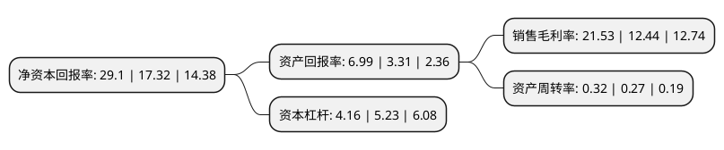

> 本页面由自动化程序生成于 2022年5月20日 01:04
> 内容可能存在错误，如有bug请提交issue至：https://github.com/Eroleice/doc-pi/issues
{.is-warning}

# 上市公司基本情况

## 基本资料

天津津滨发展股份有限公司（以下简称“津滨发展”）成立于1998年12月31日，天津市。于1999年04月22日在深交所主板上市。

津滨发展注册资本161,727.223万元，主要业务:商品销售，房屋租赁，房屋土地销售。以下是详细信息：

- 公司名称: 天津津滨发展股份有限公司
- 股票代码: 000897.SZ
- 所在地: 天津 - 天津市
- 成立日期: 1998年12月31日
- 注册资本: 161,727.223万元
- 法定代表人: 华志忠
- 主营业务: 商品销售，房屋租赁，房屋土地销售
- 公司官网: www.jbdc.com.cn
- 公司介绍: 公司是天津滨海新区首家以募集方式创立的股份公司。公司自成立以来，先后投资兴建天大科技园、滨海金融街(东区)等重点项目，投资开发了雅都天元居、玛歌庄园、颐贤里、境界梅江等房地产项目，为津滨发展在工业园区、商用地产和中高端民用房地产等不同的物业形态中树立了较好的品牌形象。公司先后连续荣获中国房地产百强企业、全国服务类500强、天津服务业企业60强等荣誉称号。“津滨发展—建筑岁月之美”的品牌理念越来越被广大消费者熟知，有效地提升了津滨品牌的知名度和影响力。

## 股东及高管情况

上市公司第一大股东为天津泰达建设集团有限公司，持股338,312,340股，占比20.92%，**疑似为**上市公司实际控制人。

截至2022年03月31日，上市公司的前十大股东中，共有3名机构股东，7个产品账户，其中5%以上大股东共有1名。上市公司前十大股东明细如下：

> 未能通过持股比例判定出上市公司实际控制人（持股30%以上）
> 可能存在通过间接持股、联合持股、协议控制等方式拥有实际控制权的主体，具体请参考上市公司定期公告！
{.is-warning}

> 截至2022年03月31日，上市公司前十大股东信息如下：

| 股东名称 | 持股数量（股） | 持股比例 |
| --- | --- | --- |
| 天津泰达建设集团有限公司 | 338,312,340 | 20.92% |
| 源润控股集团股份有限公司 | 35,706,486 | 2.21% |
| 天津泰达投资控股有限公司 | 32,460,442 | 2.01% |
| 博时基金-农业银行-博时中证金融资产管理计划 | 21,728,800 | 1.34% |
| 大成基金-农业银行-大成中证金融资产管理计划 | 21,728,800 | 1.34% |
| 银华基金-农业银行-银华中证金融资产管理计划 | 21,728,800 | 1.34% |
| 广发基金-农业银行-广发中证金融资产管理计划 | 21,728,800 | 1.34% |
| 中欧基金-农业银行-中欧中证金融资产管理计划 | 21,728,800 | 1.34% |
| 工银瑞信基金-农业银行-工银瑞信中证金融资产管理计划 | 21,728,800 | 1.34% |
| 南方基金-农业银行-南方中证金融资产管理计划 | 21,728,800 | 1.34% |

## 利润表分析

上市公司2021年总收入为22.54亿元，净利润为4.85亿元，实现盈利。

## 杜邦分析

> 数据列示周期：2021年 | 2020年 | 2019年
{.is-info}

上市公司的净资产收益率在近一年有所上升，上升幅度为68.01%，其变化情况分解如下：
- 上市公司的销售毛利率在近一年上升了73.07%，可能是生产效率的提升、商品原材料价格下跌或商品价格的上涨所致。
- 上市公司的资产周转率在近一年上升了18.52%，可能是源自于更快的销售回款或库存管理效果提升。
- 上市公司的财务杠杆比率在近一年下降了-20.46%，可能是减少负债降低财务费用。

