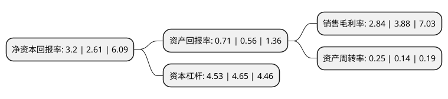

> 本页面由自动化程序生成于 2022年5月20日 01:04
> 内容可能存在错误，如有bug请提交issue至：https://github.com/Eroleice/doc-pi/issues
{.is-warning}

# 上市公司基本情况

## 基本资料

湖北福星科技股份有限公司（以下简称“福星股份”）成立于1993年06月08日，孝感市。于1999年06月18日在深交所主板上市。

福星股份注册资本94,932.247万元，主营业务:金属丝，绳及其制品的制造，销售和出口业务;商品房销售。主要产品:子午轮胎钢帘线，钢丝绳系列，钢绞线，钢丝系列，商品房。以下是详细信息：

- 公司名称: 湖北福星科技股份有限公司
- 股票代码: 000926.SZ
- 所在地: 湖北 - 孝感市
- 成立日期: 1993年06月08日
- 注册资本: 94,932.247万元
- 法定代表人: 谭少群
- 主营业务: 主营业务:金属丝，绳及其制品的制造，销售和出口业务;商品房销售主要产品:子午轮胎钢帘线，钢丝绳系列，钢绞线，钢丝系列，商品房
- 公司官网: www.chinafxkj.com
- 公司介绍: 公司是国家大型企业、国家重点高新技术企业、湖北省“巨人工程”企业、A股上市公司。先后获得“全国五一劳动奖状”、“全国质量管理先进单位”、“全国守合同重信用单位”、“全国诚信守法乡镇企业”、“全国文明示范乡镇企业”、“中国最具挑战潜力十大民营企业”、“中国优秀诚信企业”、“全国文明单位”等荣誉。质量管理通过了ISO9001:2008、ISO/TS16949:2009、英国劳氏船级社、欧盟CE的认证，“福星”商标被认定为“湖北省著名商标”和“中国驰名商标”。钢帘线、钢丝绳、PC钢绞线产品被评为“湖北名牌”产品;PC钢绞线和钢丝绳被评为“国家免检产品”;钢丝绳被评为“中国名牌产品”:胎圈钢丝被评为年度湖北名牌产品;“福星”牌钢丝、钢帘线被评为年度中国橡胶工业协会推荐品牌产品。

## 股东及高管情况

上市公司第一大股东为福星集团控股有限公司，持股233,928,648股，占比24.64%，**疑似为**上市公司实际控制人。

截至2022年03月31日，上市公司的前十大股东中，共有7名自然人股东，2名机构股东，1个海外主体，其中5%以上大股东共有1名。上市公司前十大股东明细如下：

> 未能通过持股比例判定出上市公司实际控制人（持股30%以上）
> 可能存在通过间接持股、联合持股、协议控制等方式拥有实际控制权的主体，具体请参考上市公司定期公告！
{.is-warning}

> 截至2022年03月31日，上市公司前十大股东信息如下：

| 股东名称 | 持股数量（股） | 持股比例 |
| --- | --- | --- |
| 福星集团控股有限公司 | 233,928,648 | 24.64% |
| 谭少群 | 16,296,535 | 1.72% |
| 周杰 | 14,347,698 | 1.51% |
| 李必胜 | 9,355,345 | 0.99% |
| 邹英姿 | 6,189,209 | 0.65% |
| 张沐城 | 6,000,000 | 0.63% |
| 冯子来 | 5,791,900 | 0.61% |
| 高华-汇丰-GOLDMAN, SACHS & CO.LLC | 4,814,172 | 0.51% |
| 薛汉明 | 4,579,200 | 0.48% |
| 重庆市聚隆实业有限公司 | 4,550,000 | 0.48% |

## 利润表分析

上市公司2021年总收入为125.43亿元，净利润为3.56亿元，实现盈利。

## 杜邦分析

> 数据列示周期：2021年 | 2020年 | 2019年
{.is-info}

上市公司的净资产收益率在近一年有所上升，上升幅度为22.61%，其变化情况分解如下：
- 上市公司的销售毛利率在近一年下降了-26.8%，可能是生产效率的下降、商品原材料价格上涨或商品价格的下跌所致。
- 上市公司的资产周转率在近一年上升了78.57%，可能是源自于更快的销售回款或库存管理效果提升。
- 上市公司的财务杠杆比率在近一年下降了-2.58%，可能是减少负债降低财务费用。

