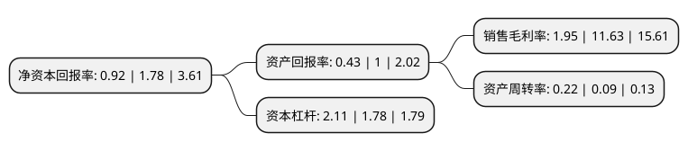

> 本页面由自动化程序生成于 2022年5月20日 01:04
> 内容可能存在错误，如有bug请提交issue至：https://github.com/Eroleice/doc-pi/issues
{.is-warning}

# 上市公司基本情况

## 基本资料

天津天保基建股份有限公司（以下简称“天保基建”）成立于1998年09月30日，天津市。于2000年04月06日在深交所主板上市。

天保基建注册资本110,983.09万元，主要业务:房地产开发和销售。以下是详细信息：

- 公司名称: 天津天保基建股份有限公司
- 股票代码: 000965.SZ
- 所在地: 天津 - 天津市
- 成立日期: 1998年09月30日
- 注册资本: 110,983.09万元
- 法定代表人: 夏仲昊
- 主营业务: 房地产开发和销售
- 公司官网: www.tbjijian.com
- 公司介绍: 公司是目前天津保税区区属唯一一家国有上市公司，主营业务为房地产开发和基础设施建设。随着开发项目的建成和运营，公司规模和影响力不断扩大，所开发的住宅、公寓、写字楼等多个项目受到社会各界好评，获得众多荣誉。其中，天保金海岸项目获得“最具潜力经典大盘奖”、“投资潜力楼盘奖”、天津市“结构海河杯”、天津市“市级文明工地”“市级观摩工地”等奖项；天津国际贸易与航运服务区海景大厦项目获天津市建设工程质量最高奖项“金奖海河杯”；空港青年公寓项目获天津市“结构海河杯”和市级文明工地称号；呼和浩特市北垣吧街项目获中国人居环境发展建设“呼和浩特市十佳商业楼盘”等奖项。

## 股东及高管情况

上市公司第一大股东为天津天保控股有限公司，持股570,995,896股，占比51.45%，为上市公司实际控制人。

截至2022年03月31日，上市公司的前十大股东中，共有9名自然人股东，1名机构股东，其中5%以上大股东共有1名。上市公司前十大股东明细如下：

> 截至2022年03月31日，上市公司前十大股东信息如下：

| 股东名称 | 持股数量（股） | 持股比例 |
| --- | --- | --- |
| 天津天保控股有限公司 | 570,995,896 | 51.45% |
| 徐晓 | 13,000,000 | 1.17% |
| 余保青 | 11,667,505 | 1.05% |
| 薛荣富 | 9,791,700 | 0.88% |
| 顾伯江 | 9,573,636 | 0.86% |
| 何海波 | 8,340,714 | 0.75% |
| 余冬娟 | 8,045,760 | 0.72% |
| 李鲁超 | 6,017,500 | 0.54% |
| 卢聪 | 5,932,710 | 0.53% |
| 方奕忠 | 5,212,036 | 0.47% |

## 利润表分析

上市公司2021年总收入为25.4亿元，净利润为0.49亿元，实现盈利。

## 杜邦分析

> 数据列示周期：2021年 | 2020年 | 2019年
{.is-info}

上市公司的净资产收益率在近一年有所下降，下降幅度为-48.31%，其变化情况分解如下：
- 上市公司的销售毛利率在近一年下降了-83.23%，可能是生产效率的下降、商品原材料价格上涨或商品价格的下跌所致。
- 上市公司的资产周转率在近一年上升了144.44%，可能是源自于更快的销售回款或库存管理效果提升。
- 上市公司的财务杠杆比率在近一年上升了18.54%，可能是增加负债扩大生产规模。

