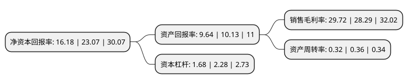

> 本页面由自动化程序生成于 2022年5月20日 01:05
> 内容可能存在错误，如有bug请提交issue至：https://github.com/Eroleice/doc-pi/issues
{.is-warning}

# 上市公司基本情况

## 基本资料

广东世荣兆业股份有限公司（以下简称“世荣兆业”）成立于2000年12月28日，珠海市。于2004年07月08日在深交所中小板上市。

世荣兆业注册资本80,909.563万元，公司及子公司主要产品为商品住宅及商铺。以下是详细信息：

- 公司名称: 广东世荣兆业股份有限公司
- 股票代码: 002016.SZ
- 所在地: 广东 - 珠海市
- 成立日期: 2000年12月28日
- 注册资本: 80,909.563万元
- 法定代表人: 李绪鹏
- 主营业务: 公司及子公司主要产品为商品住宅及商铺
- 公司官网: www.shirongzhaoye.com
- 公司介绍: 公司主营业务转型为包括房地产开发经营和医疗器械生产销售两部分业务。公司是广东省高新技术企业、技术创新优势企业和专利试点企业，是国内较早通过ISO9002国际质量体系认证及中国医疗器械行业CMD认证的医疗器械企业，为国内医疗器械行业的龙头企业。完成重大资产重组后，公司的主营业务由医疗器械业务成功转型为房地产开发与经营，之后公司专注于房地产主业，并取得良好的经营业绩，公司的市场竞争力和持续发展能力不断得到提升。公司始终坚持诚信经营的方针和稳健理性的发展理念，不断夯实发展根基。

## 股东及高管情况

上市公司第一大股东为梁社增，持股433,440,000股，占比53.57%，为上市公司实际控制人。

截至2022年03月31日，上市公司的前十大股东中，共有9名自然人股东，1名机构股东，其中5%以上大股东共有2名。上市公司前十大股东明细如下：

> 截至2022年03月31日，上市公司前十大股东信息如下：

| 股东名称 | 持股数量（股） | 持股比例 |
| --- | --- | --- |
| 梁社增 | 433,440,000 | 53.57% |
| 梁家荣 | 163,000,000 | 20.15% |
| 蔡伟民 | 9,552,054 | 1.18% |
| 陈武峰 | 5,993,576 | 0.74% |
| 罗建华 | 5,333,949 | 0.66% |
| 黄旭文 | 5,280,875 | 0.65% |
| 童飞 | 3,211,822 | 0.4% |
| 张洁 | 3,133,018 | 0.39% |
| 日喀则市世荣投资管理有限公司 | 3,000,000 | 0.37% |
| 高龙伟 | 1,937,300 | 0.24% |

## 利润表分析

上市公司2021年总收入为23.8亿元，净利润为7.07亿元，实现盈利。

## 杜邦分析

> 数据列示周期：2021年 | 2020年 | 2019年
{.is-info}

上市公司的净资产收益率在近一年有所下降，下降幅度为-29.87%，其变化情况分解如下：
- 上市公司的销售毛利率在近一年上升了5.05%，可能是生产效率的提升、商品原材料价格下跌或商品价格的上涨所致。
- 上市公司的资产周转率在近一年下降了-11.11%，可能是源自于更慢的销售回款或库存管理效果下降。
- 上市公司的财务杠杆比率在近一年下降了-26.32%，可能是减少负债降低财务费用。

