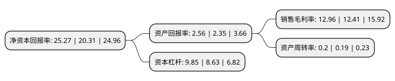

> 本页面由自动化程序生成于 2022年5月20日 01:07
> 内容可能存在错误，如有bug请提交issue至：https://github.com/Eroleice/doc-pi/issues
{.is-warning}

# 上市公司基本情况

## 基本资料

杭州滨江房产集团股份有限公司（以下简称“滨江集团”）成立于1996年08月22日，杭州市。于2008年05月29日在深交所中小板上市。

滨江集团注册资本311,144.389万元，房地产开发以下是详细信息：

- 公司名称: 杭州滨江房产集团股份有限公司
- 股票代码: 002244.SZ
- 所在地: 浙江 - 杭州市
- 成立日期: 1996年08月22日
- 注册资本: 311,144.389万元
- 法定代表人: 戚金兴
- 主营业务: 房地产开发
- 公司官网: www.binjiang.com.cn
- 公司介绍: 公司具有建设部一级开发资质，全国民营企业500强，中国房地产企业50强，长三角房地产领军企业。公司秉承“创造生活，建筑家”的专业理念，做行业品质引领者，区域品牌领跑者，形成了“品质为基础、战略为导向、品牌为中心、精干高效为手段”的企业核心竞争力。在产业发展战略方面，公司业已成为以房地产开发为主体，服务业和金融业并重的大型股份有限公司。公司积极转型升级，布局小镇建设，开拓美国西雅图等海外市场，积极对外多元投资，包括互联网+、生物医药、新能源及工业4.0等，全面开启了多元发展的新蓝图。

## 股东及高管情况

上市公司第一大股东为杭州滨江投资控股有限公司，持股1,413,012,872股，占比45.41%，为上市公司实际控制人。

截至2022年03月31日，上市公司的前十大股东中，共有4名自然人股东，1名机构股东，4个产品账户，1个海外主体，其中5%以上大股东共有2名。上市公司前十大股东明细如下：

> 截至2022年03月31日，上市公司前十大股东信息如下：

| 股东名称 | 持股数量（股） | 持股比例 |
| --- | --- | --- |
| 杭州滨江投资控股有限公司 | 1,413,012,872 | 45.41% |
| 戚金兴 | 371,598,600 | 11.94% |
| 朱慧明 | 100,260,800 | 3.22% |
| 莫建华 | 100,260,800 | 3.22% |
| 香港中央结算有限公司(陆股通) | 57,442,888 | 1.85% |
| 全国社保基金四一三组合 | 52,915,097 | 1.7% |
| 珠海阿巴马资产管理有限公司-阿巴马元享红利72号私募证券投资基金 | 37,600,000 | 1.21% |
| 戚加奇 | 31,040,000 | 1% |
| 珠海阿巴马资产管理有限公司-阿巴马元享红利74号私募证券投资基金 | 28,950,000 | 0.93% |
| 珠海阿巴马资产管理有限公司-阿巴马元享红利71号私募证券投资基金 | 28,880,000 | 0.93% |

## 利润表分析

上市公司2021年总收入为379.76亿元，净利润为49.2亿元，实现盈利。

## 杜邦分析

> 数据列示周期：2021年 | 2020年 | 2019年
{.is-info}

上市公司的净资产收益率在近一年有所上升，上升幅度为24.42%，其变化情况分解如下：
- 上市公司的销售毛利率在近一年上升了4.43%，可能是生产效率的提升、商品原材料价格下跌或商品价格的上涨所致。
- 上市公司的资产周转率在近一年上升了5.26%，可能是源自于更快的销售回款或库存管理效果提升。
- 上市公司的财务杠杆比率在近一年上升了14.14%，可能是增加负债扩大生产规模。

