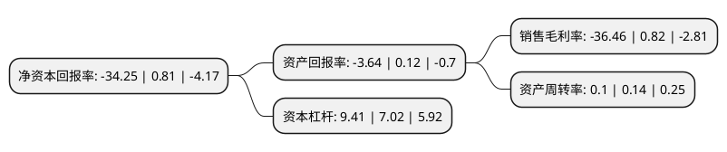

> 本页面由自动化程序生成于 2022年5月20日 01:07
> 内容可能存在错误，如有bug请提交issue至：https://github.com/Eroleice/doc-pi/issues
{.is-warning}

# 上市公司基本情况

## 基本资料

南国置业股份有限公司（以下简称“南国置业”）成立于1998年07月27日，武汉市。于2009年11月06日在深交所中小板上市。

南国置业注册资本173,421.577万元，商业地产以下是详细信息：

- 公司名称: 南国置业股份有限公司
- 股票代码: 002305.SZ
- 所在地: 湖北 - 武汉市
- 成立日期: 1998年07月27日
- 注册资本: 173,421.577万元
- 法定代表人: 武琳
- 主营业务: 商业地产
- 公司官网: www.langold.com.cn
- 公司介绍: 公司是一家武汉市以商业地产为引导的综合性物业开发企业。目前，南国置业确立了以商业地产开发与运营为主体，以地产金融业务和产业地产等新兴业务为两翼的“一体两翼”发展战略，并围绕“5+5”(5个重要城市：北京、上海、武汉、成都、南京；5大业务板块：项目开发、商业运营、金融业务、产业园、养老产业)和“三个重大”(重要城市、重大交通节点、重大综合体项目)的方向，进行重要战略布局。2016年，南国置业增资中文发集团文化有限公司，中文文化是中国文化产业发展集团公司面向文化创意产业的投资平台。南国置业将结合自身商业运营优势与中文文化产业优势，加强在文化创意产业的业态升级，实现商业地产转型的提前布局，提供满足政府和社会需求的文化商业场所。

## 股东及高管情况

上市公司第一大股东为中国电建地产集团有限公司，持股388,986,313股，占比22.43%，**疑似为**上市公司实际控制人。

截至2022年03月31日，上市公司的前十大股东中，共有3名自然人股东，3名机构股东，3个产品账户，1个海外主体，其中5%以上大股东共有2名。上市公司前十大股东明细如下：

> 未能通过持股比例判定出上市公司实际控制人（持股30%以上）
> 可能存在通过间接持股、联合持股、协议控制等方式拥有实际控制权的主体，具体请参考上市公司定期公告！
{.is-warning}

> 截至2022年03月31日，上市公司前十大股东信息如下：

| 股东名称 | 持股数量（股） | 持股比例 |
| --- | --- | --- |
| 中国电建地产集团有限公司 | 388,986,313 | 22.43% |
| 武汉新天地投资有限公司 | 313,215,984 | 18.06% |
| 曾林森 | 17,032,100 | 0.98% |
| JPMORGAN CHASE BANK,NATIONAL ASSOCIATION | 11,557,677 | 0.67% |
| 中山市正信资产管理有限公司-正信数据智能价值成长1号私募证券投资基金 | 10,470,600 | 0.6% |
| 陈凯 | 10,100,000 | 0.58% |
| 曾鸿斌 | 8,394,250 | 0.48% |
| 武汉闻一多基金会 | 7,834,000 | 0.45% |
| 中国国际金融香港资产管理有限公司-客户资金2 | 7,583,209 | 0.44% |
| 中国光大银行股份有限公司-华夏磐益一年定期开放混合型证券投资基金 | 7,079,300 | 0.41% |

## 杜邦分析

> 数据列示周期：2021年 | 2020年 | 2019年
{.is-info}

上市公司的净资产收益率在近一年有所下降，下降幅度为-4328.4%，其变化情况分解如下：
- 上市公司的销售毛利率在近一年下降了-4546.34%，可能是生产效率的下降、商品原材料价格上涨或商品价格的下跌所致。
- 上市公司的资产周转率在近一年下降了-28.57%，可能是源自于更慢的销售回款或库存管理效果下降。
- 上市公司的财务杠杆比率在近一年上升了34.05%，可能是增加负债扩大生产规模。

