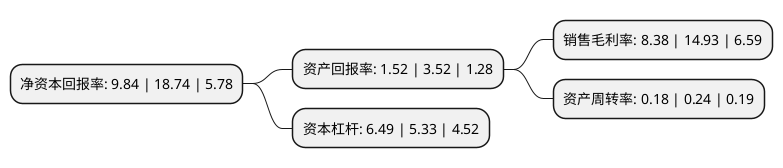

> 本页面由自动化程序生成于 2022年5月20日 01:08
> 内容可能存在错误，如有bug请提交issue至：https://github.com/Eroleice/doc-pi/issues
{.is-warning}

# 上市公司基本情况

## 基本资料

深圳市新南山控股(集团)股份有限公司（以下简称“南山控股”）成立于2001年04月30日，深圳市。于2009年12月03日在深交所中小板上市。

南山控股注册资本270,778.251万元，主要业务:房地产业务，集成房屋业务，船舶舱室配套业务，塔机租赁业务及其他业务以下是详细信息：

- 公司名称: 深圳市新南山控股(集团)股份有限公司
- 股票代码: 002314.SZ
- 所在地: 广东 - 深圳市
- 成立日期: 2001年04月30日
- 注册资本: 270,778.251万元
- 法定代表人: 王世云
- 主营业务: 房地产业务，集成房屋业务，船舶舱室配套业务，塔机租赁业务及其他业务
- 公司官网: www.xnskg.cn
- 公司介绍: 公司是一家以现代高端仓储物流为战略性主业，以房地产开发为支撑性主业，以产城综合开发为培育性主业的综合性企业集团。公司致力于为客户提供优质专业高效的物流、产业城市空间及金融投资服务，成为最具竞争力的行业领导者，创造最大价值回报股东、员工和社会。公司控股子公司宝湾物流控股有限公司已发展成为国内知名的物流园区开发商和运营商，房地产开发业务区域综合竞争能力突出，产城综合开发已在“物流驱动商贸”模式方面积累了一定的开发和运营经验，连续获得“改革开放四十年中国物流行业代表性企业”、“2018年中国物流杰出企业”和“广东省诚信物流企业”等荣誉，品牌影响力持续扩大。

## 股东及高管情况

上市公司第一大股东为中国南山开发(集团)股份有限公司，持股1,570,139,538股，占比57.99%，为上市公司实际控制人。

截至2022年03月31日，上市公司的前十大股东中，共有3名自然人股东，3名机构股东，2个产品账户，2个海外主体，其中5%以上大股东共有2名。上市公司前十大股东明细如下：

> 截至2022年03月31日，上市公司前十大股东信息如下：

| 股东名称 | 持股数量（股） | 持股比例 |
| --- | --- | --- |
| 中国南山开发(集团)股份有限公司 | 1,570,139,538 | 57.99% |
| 赤晓企业有限公司 | 282,880,000 | 10.45% |
| China Logistics Holding PTE.LTD. | 135,389,056 | 5% |
| 香港中央结算有限公司(陆股通) | 14,940,099 | 0.55% |
| 招商证券香港有限公司 | 11,637,238 | 0.43% |
| 俞志翔 | 6,618,715 | 0.24% |
| 中信银行股份有限公司-中银丰利灵活配置混合型证券投资基金 | 5,375,400 | 0.2% |
| 招商银行股份有限公司-中银益利灵活配置混合型证券投资基金 | 4,262,300 | 0.16% |
| 覃荣林 | 4,257,500 | 0.16% |
| 缪翚 | 4,009,000 | 0.15% |

## 利润表分析

上市公司2021年总收入为111.8亿元，净利润为9.36亿元，实现盈利。

## 杜邦分析

> 数据列示周期：2021年 | 2020年 | 2019年
{.is-info}

上市公司的净资产收益率在近一年有所下降，下降幅度为-47.49%，其变化情况分解如下：
- 上市公司的销售毛利率在近一年下降了-43.87%，可能是生产效率的下降、商品原材料价格上涨或商品价格的下跌所致。
- 上市公司的资产周转率在近一年下降了-25%，可能是源自于更慢的销售回款或库存管理效果下降。
- 上市公司的财务杠杆比率在近一年上升了21.76%，可能是增加负债扩大生产规模。

