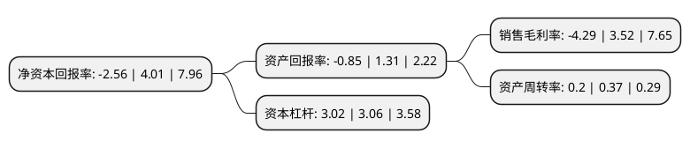

> 本页面由自动化程序生成于 2022年5月20日 01:24
> 内容可能存在错误，如有bug请提交issue至：https://github.com/Eroleice/doc-pi/issues
{.is-warning}

# 上市公司基本情况

## 基本资料

上海大名城企业股份有限公司（以下简称“大名城”）成立于1996年07月18日，上海市。于1997年07月03日在上交所主板上市。

大名城注册资本247,532.506万元，主营业务主要为:房地产综合开发，建造，销售商品房，物业管理，物业租赁，公共基础设施开发与建设，建筑装饰安装工程等。以下是详细信息：

- 公司名称: 上海大名城企业股份有限公司
- 股票代码: 600094.SH
- 所在地: 上海 - 上海市
- 成立日期: 1996年07月18日
- 注册资本: 247,532.506万元
- 法定代表人: 俞锦
- 主营业务: 主营业务主要为:房地产综合开发，建造，销售商品房，物业管理，物业租赁，公共基础设施开发与建设，建筑装饰安装工程等
- 公司官网: www.greattown.cn
- 公司介绍: 公司拥有房地产一级开发资质，隶属于名城企业集团。公司业务涵盖房地产综合开发、商业地产运营、产业地产运营、园林景观设计、物业服务管理、金融投资等领域。公司秉持“扎根福建本土，深耕一线城市”的发展战略，以“布局城镇化，打造城市综合功能开发的城市运营商”为战略目标，构建“产业+资本”双轮驱动发展模式。公司运用“一次性规模开发、全过程品牌建设”的开发模式，坚持“为城市创造精品”的开发理念，契合“一带一路”、“自贸区”等国家战略，布局长三角、大福建、大西北、珠三角四大区域。公司将紧紧把握新的发展机遇，以产业为基础，以资本为推手，构建产城融合一体化良性发展格局，继续助力中国经济发展。

## 股东及高管情况

上市公司第一大股东为名城控股集团有限公司，持股235,587,483股，占比9.52%，**疑似为**上市公司实际控制人。

截至2022年04月01日，上市公司的前十大股东中，共有6名自然人股东，1名机构股东，2个产品账户，1个海外主体，其中5%以上大股东共有3名。上市公司前十大股东明细如下：

> 未能通过持股比例判定出上市公司实际控制人（持股30%以上）
> 可能存在通过间接持股、联合持股、协议控制等方式拥有实际控制权的主体，具体请参考上市公司定期公告！
{.is-warning}

> 上市公司第一大股东持股不超过10%，请检查是否存在公司控制权风险！
{.is-danger}

> 截至2022年04月01日，上市公司前十大股东信息如下：

| 股东名称 | 持股数量（股） | 持股比例 |
| --- | --- | --- |
| 名城控股集团有限公司 | 235,587,483 | 9.52% |
| 俞丽 | 171,457,717 | 6.93% |
| 陈华云 | 125,842,450 | 5.08% |
| 俞锦 | 123,766,253 | 5% |
| 金元顺安基金-宁波银行-西部信托-大名城定增事务管理类单一资金信托计划 | 108,122,028 | 4.37% |
| 俞培明 | 100,000,000 | 4.04% |
| 徐剑明 | 59,670,000 | 2.41% |
| 上海大名城企业股份有限公司回购专用证券账户 | 54,475,112 | 2.2% |
| 俞凯 | 50,000,000 | 2.02% |
| 香港中央结算有限公司(陆股通) | 47,469,452 | 1.92% |

## 利润表分析

上市公司2021年总收入为76.61亿元，净利润为-3.3亿元，**未实现盈利**。

## 杜邦分析

> 数据列示周期：2021年 | 2020年 | 2019年
{.is-info}

上市公司的净资产收益率在近一年有所下降，下降幅度为-163.84%，其变化情况分解如下：
- 上市公司的销售毛利率在近一年下降了-221.87%，可能是生产效率的下降、商品原材料价格上涨或商品价格的下跌所致。
- 上市公司的资产周转率在近一年下降了-45.95%，可能是源自于更慢的销售回款或库存管理效果下降。
- 上市公司的财务杠杆比率在近一年下降了-1.31%，可能是减少负债降低财务费用。

