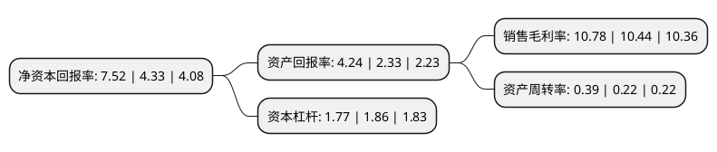

> 本页面由自动化程序生成于 2022年5月20日 01:24
> 内容可能存在错误，如有bug请提交issue至：https://github.com/Eroleice/doc-pi/issues
{.is-warning}

# 上市公司基本情况

## 基本资料

北京市大龙伟业房地产开发股份有限公司（以下简称“大龙地产”）成立于1998年05月08日，北京市。于1998年05月26日在上交所主板上市。

大龙地产注册资本83,000.323万元，主营业务为房地产开发和建筑施工。以下是详细信息：

- 公司名称: 北京市大龙伟业房地产开发股份有限公司
- 股票代码: 600159.SH
- 所在地: 北京 - 北京市
- 成立日期: 1998年05月08日
- 注册资本: 83,000.323万元
- 法定代表人: 马云虎
- 主营业务: 主营业务为房地产开发和建筑施工
- 公司官网: www.dldc.com.cn
- 公司介绍: 公司是一家实力雄厚、经验丰富的房地产开发企业。公司有房地产开发、城市供暖、建筑施工、物业管理等多家企业，建立了从土地开发到物业管理的一条龙、全产业链式的集团化经营体系，整个公司统筹规划、彼此联动、协同发展，全力为居民提供优质产品，为业主提供满意服务。公司始终以开发优质房产为责任，以提升服务品质为追求，以对他人和对社会有益为宗旨，在实现企业持续健康发展的同时，不断为员工创造平台，为客户创造价值，为社会创造文明、和谐、温馨、优雅的宜居文化，为城市和历史留下值得典藏的建筑艺术精品。

## 股东及高管情况

上市公司第一大股东为北京顺义大龙城乡建设开发有限公司，持股395,916,555股，占比47.7%，为上市公司实际控制人。

截至2022年03月31日，上市公司的前十大股东中，共有9名自然人股东，1名机构股东，其中5%以上大股东共有1名。上市公司前十大股东明细如下：

> 截至2022年03月31日，上市公司前十大股东信息如下：

| 股东名称 | 持股数量（股） | 持股比例 |
| --- | --- | --- |
| 北京顺义大龙城乡建设开发有限公司 | 395,916,555 | 47.7% |
| 曹慧利 | 7,693,779 | 0.93% |
| 张鸿 | 3,851,900 | 0.46% |
| 秦立彬 | 3,136,000 | 0.38% |
| 张旭 | 3,078,400 | 0.37% |
| 李在让 | 2,621,600 | 0.32% |
| 张文杰 | 2,433,300 | 0.29% |
| 董志明 | 2,400,000 | 0.29% |
| 王淑霞 | 2,303,200 | 0.28% |
| 王石 | 2,171,501 | 0.26% |

## 利润表分析

上市公司2021年总收入为17.01亿元，净利润为1.83亿元，实现盈利。

## 杜邦分析

> 数据列示周期：2021年 | 2020年 | 2019年
{.is-info}

上市公司的净资产收益率在近一年有所上升，上升幅度为73.67%，其变化情况分解如下：
- 上市公司的销售毛利率在近一年上升了3.26%，可能是生产效率的提升、商品原材料价格下跌或商品价格的上涨所致。
- 上市公司的资产周转率在近一年上升了77.27%，可能是源自于更快的销售回款或库存管理效果提升。
- 上市公司的财务杠杆比率在近一年下降了-4.84%，可能是减少负债降低财务费用。

