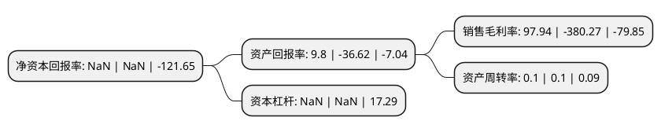

> 本页面由自动化程序生成于 2022年5月20日 01:25
> 内容可能存在错误，如有bug请提交issue至：https://github.com/Eroleice/doc-pi/issues
{.is-warning}

# 上市公司基本情况

## 基本资料

天津松江股份有限公司（以下简称“天津松江”）成立于2001年12月21日，天津市。于2000年01月27日在上交所主板上市。

天津松江注册资本341,139.436万元，主营业务:房地产开发与经营。以下是详细信息：

- 公司名称: 天津松江股份有限公司
- 股票代码: 600225.SH
- 所在地: 天津 - 天津市
- 成立日期: 2001年12月21日
- 注册资本: 341,139.436万元
- 法定代表人: 阎鹏
- 主营业务: 主营业务:房地产开发与经营
- 公司官网: www.tjsjgf.com.cn
- 公司介绍: 公司以房地产综合开发为主导产业，积累了丰富的大盘操作经验，同时注重品质开发与客户服务，强调运营管理的规范化，追求与客户建立长久的服务关系。公司积极致力于全国化发展战略，已形成了“以天津为核心，业务辐射全国”的理念，先后在天津、内蒙、广东开发了包括汐岸国际、水岸公馆、水岸江南、百合春天、百合阳光、高尔夫小镇、松江城、运河城、天骄领域、阳光诺卡、左右城、左庭右院、东湖小镇、宁越花园、帕提欧在内的各类高中档项目。2017年，公司收购卓朗科技80%股权，有助于上市公司将云计算、大数据、物联网等技术从原先比较抽象的概念逐渐转变成现实，与公司现有地产项目融为一体，进而实现“智慧城市”项目在全国其他区域的有效复制，有助于公司加快推进“房地产+智慧城市”的多元化战略转型。

## 股东及高管情况

上市公司第一大股东为天津松江股份有限公司破产企业财产处置专用账户，持股778,355,985股，占比22.82%，**疑似为**上市公司实际控制人。

截至2022年03月31日，上市公司的前十大股东中，共有2名自然人股东，7名机构股东，1个产品账户，其中5%以上大股东共有6名。上市公司前十大股东明细如下：

> 未能通过持股比例判定出上市公司实际控制人（持股30%以上）
> 可能存在通过间接持股、联合持股、协议控制等方式拥有实际控制权的主体，具体请参考上市公司定期公告！
{.is-warning}

> 截至2022年03月31日，上市公司前十大股东信息如下：

| 股东名称 | 持股数量（股） | 持股比例 |
| --- | --- | --- |
| 天津松江股份有限公司破产企业财产处置专用账户 | 778,355,985 | 22.82% |
| 天津津诚金石资本管理有限公司 | 500,000,000 | 14.66% |
| 天津天朗叁号企业管理合伙企业(有限合伙) | 400,000,000 | 11.73% |
| 天津天朗贰号企业管理合伙企业(有限合伙) | 300,000,000 | 8.79% |
| 天津滨海发展投资控股有限公司 | 274,102,592 | 8.03% |
| 天津津诚国有资本投资运营有限公司 | 187,227,959 | 5.49% |
| 天津天朗壹号企业管理合伙企业(有限合伙) | 150,000,000 | 4.4% |
| 马媛媛 | 96,769,353 | 2.84% |
| 张坤宇 | 50,000,000 | 1.47% |
| 天津滨海农村商业银行股份有限公司 | 34,201,017 | 1% |

## 利润表分析

上市公司2021年总收入为8.14亿元，净利润为7.97亿元，实现盈利。

## 杜邦分析

> 数据列示周期：2021年 | 2020年 | 2019年
{.is-info}

上市公司的净资产收益率在近一年有所下降，下降幅度为NaN%，其变化情况分解如下：
- 上市公司的销售毛利率在近一年下降了-125.76%，可能是生产效率的下降、商品原材料价格上涨或商品价格的下跌所致。
- 上市公司的资产周转率在近一年下降了0%，可能是源自于更慢的销售回款或库存管理效果下降。
- 上市公司的财务杠杆比率在近一年下降了NaN%，可能是减少负债降低财务费用。

