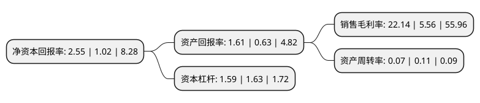

> 本页面由自动化程序生成于 2022年5月20日 01:25
> 内容可能存在错误，如有bug请提交issue至：https://github.com/Eroleice/doc-pi/issues
{.is-warning}

# 上市公司基本情况

## 基本资料

北京万通新发展集团股份有限公司（以下简称“万通发展”）成立于1998年12月30日，北京市。于2000年09月22日在上交所主板上市。

万通发展注册资本205,400.93万元，主营业务:房地产开发;销售商品房;停车场建设及经营管理;信息咨询(不含中介);技术咨询;劳务派遣;股权投资及管理;资产管理。以下是详细信息：

- 公司名称: 北京万通新发展集团股份有限公司
- 股票代码: 600246.SH
- 所在地: 北京 - 北京市
- 成立日期: 1998年12月30日
- 注册资本: 205,400.93万元
- 法定代表人: 王忆会
- 主营业务: 主营业务:房地产开发;销售商品房;停车场建设及经营管理;信息咨询(不含中介);技术咨询;劳务派遣;股权投资及管理;资产管理
- 公司官网: www.vantone.com
- 公司介绍: 公司是一家专业化地产公司，发展以住宅开发和商用物业为核心的业务体系，主营方向为高档住宅物业开发与经营，具备一级开发资质。公司是中国房地产行业领导品牌企业之一，是最受尊敬的行业品牌之一，也是“中国城市房地产开发商策略联盟”的联合创始企业和轮值主席单位，是全国工商联房地产商会轮值主席单位。公司以绿色公司战略来规范企业的持续发展，并不拘泥于以往的成就，积极从自身创新出发，激发企业活力，以房地产业务为基础，致力探索并力行传统房地产由第二产业生产型向服务型的第三产业转化。万通地产正以全新形象展现在公众面前，它是绿色地产行业的领先者，会成为资本市场上投资者认可的优质企业。

## 股东及高管情况

上市公司第一大股东为嘉华东方控股(集团)有限公司，持股692,771,141股，占比33.73%，为上市公司实际控制人。

截至2022年04月26日，上市公司的前十大股东中，共有4名自然人股东，4名机构股东，1个产品账户，1个海外主体，其中5%以上大股东共有4名。上市公司前十大股东明细如下：

> 截至2022年04月26日，上市公司前十大股东信息如下：

| 股东名称 | 持股数量（股） | 持股比例 |
| --- | --- | --- |
| 嘉华东方控股(集团)有限公司 | 692,771,141 | 33.73% |
| 万通投资控股股份有限公司 | 322,729,789 | 15.71% |
| GLP Capital Investment 4(HK)Limited | 205,400,931 | 10% |
| 北京万通新发展集团股份有限公司回购专用证券账户 | 137,093,226 | 6.67% |
| 宁波阡誓企业管理合伙企业(有限合伙) | 10,800,000 | 0.53% |
| 北京方顺科技有限公司 | 9,327,630 | 0.45% |
| 丁春红 | 9,219,961 | 0.45% |
| 谢向东 | 7,491,345 | 0.36% |
| 金燕 | 7,000,055 | 0.34% |
| 上官雨时 | 6,152,300 | 0.3% |

## 利润表分析

上市公司2021年总收入为8.13亿元，净利润为1.8亿元，实现盈利。

## 杜邦分析

> 数据列示周期：2021年 | 2020年 | 2019年
{.is-info}

上市公司的净资产收益率在近一年有所上升，上升幅度为150%，其变化情况分解如下：
- 上市公司的销售毛利率在近一年上升了298.2%，可能是生产效率的提升、商品原材料价格下跌或商品价格的上涨所致。
- 上市公司的资产周转率在近一年下降了-36.36%，可能是源自于更慢的销售回款或库存管理效果下降。
- 上市公司的财务杠杆比率在近一年下降了-2.45%，可能是减少负债降低财务费用。

