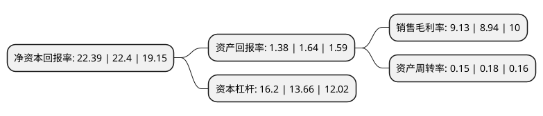

> 本页面由自动化程序生成于 2022年5月20日 01:25
> 内容可能存在错误，如有bug请提交issue至：https://github.com/Eroleice/doc-pi/issues
{.is-warning}

# 上市公司基本情况

## 基本资料

珠海华发实业股份有限公司（以下简称“华发股份”）成立于1992年08月18日，珠海市。于2004年02月25日在上交所主板上市。

华发股份注册资本211,716.112万元，主要产品:本公司主要产品是住宅，车库及商铺等。以下是详细信息：

- 公司名称: 珠海华发实业股份有限公司
- 股票代码: 600325.SH
- 所在地: 广东 - 珠海市
- 成立日期: 1992年08月18日
- 注册资本: 211,716.112万元
- 法定代表人: 李光宁
- 主营业务: 主要产品:本公司主要产品是住宅，车库及商铺等
- 公司官网: www.cnhuafas.com
- 公司介绍: 公司是一家从事房地产开发的企业。公司始终坚持诚信经营的方针，秉承“建筑理想家”、“越完美越追求完美”的宗旨和信念，勇于开拓，锐意创新，成功打造了一系列房地产精品项目，多个项目获得国家、省、市各项殊荣。鸿景花园、华发新城、华发世纪城、华发水郡、华发生态庄园成为了全国知名的楼宇品牌。公司实施“立足珠海，面向全国”的发展战略，在巩固珠海房地产企业龙头地位的基础上，稳步推进对外扩张步伐，呈现了由单一城市、单一区域向多个城市、多个区域方向发展的良好态势，并从单纯的住宅开发商向包括精品住宅、商业地产、旅游地产、土地一级开发、保障性住房在内的综合性地产商跨越，获得了多项荣誉。在快速发展的同时，公司树立强烈的社会责任感，关注社会民生，热心支持并积极参与包括教育、医疗、援藏、抗震救灾、优军优属、环境保护、志愿者服务、禁毒、老年人事业和市政工程等各项社会公益事业。

## 股东及高管情况

上市公司第一大股东为珠海华发集团有限公司，持股512,379,083股，占比24.2%，**疑似为**上市公司实际控制人。

截至2022年03月31日，上市公司的前十大股东中，共有1名自然人股东，3名机构股东，5个产品账户，1个海外主体，其中5%以上大股东共有1名。上市公司前十大股东明细如下：

> 未能通过持股比例判定出上市公司实际控制人（持股30%以上）
> 可能存在通过间接持股、联合持股、协议控制等方式拥有实际控制权的主体，具体请参考上市公司定期公告！
{.is-warning}

> 截至2022年03月31日，上市公司前十大股东信息如下：

| 股东名称 | 持股数量（股） | 持股比例 |
| --- | --- | --- |
| 珠海华发集团有限公司 | 512,379,083 | 24.2% |
| 招商银行股份有限公司-上证红利交易型开放式指数证券投资基金 | 79,766,254 | 3.77% |
| 中央汇金资产管理有限责任公司 | 64,827,120 | 3.06% |
| 香港中央结算有限公司(陆股通) | 56,446,749 | 2.67% |
| 珠海华发综合发展有限公司 | 48,877,280 | 2.31% |
| 华金证券-珠海华发综合发展有限公司-华金证券融汇314号单一资产管理计划 | 42,000,000 | 1.98% |
| 中国建设银行股份有限公司-华夏兴和混合型证券投资基金 | 35,407,620 | 1.67% |
| 黄力志 | 35,048,846 | 1.66% |
| 交通银行-华夏蓝筹核心混合型证券投资基金(LOF) | 22,811,845 | 1.08% |
| 全国社保基金一零七组合 | 20,226,322 | 0.96% |

## 利润表分析

上市公司2021年总收入为512.4亿元，净利润为46.76亿元，实现盈利。

## 杜邦分析

> 数据列示周期：2021年 | 2020年 | 2019年
{.is-info}

上市公司的净资产收益率在近一年有所下降，下降幅度为-0.04%，其变化情况分解如下：
- 上市公司的销售毛利率在近一年上升了2.13%，可能是生产效率的提升、商品原材料价格下跌或商品价格的上涨所致。
- 上市公司的资产周转率在近一年下降了-16.67%，可能是源自于更慢的销售回款或库存管理效果下降。
- 上市公司的财务杠杆比率在近一年上升了18.59%，可能是增加负债扩大生产规模。

