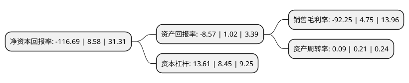

> 本页面由自动化程序生成于 2022年5月20日 01:26
> 内容可能存在错误，如有bug请提交issue至：https://github.com/Eroleice/doc-pi/issues
{.is-warning}

# 上市公司基本情况

## 基本资料

华夏幸福基业股份有限公司（以下简称“华夏幸福”）成立于1993年05月28日，廊坊市。于2003年12月30日在上交所主板上市。

华夏幸福注册资本391,438.178万元，主要业务板块包括产业园区开发和房地产开发两大业务板块，产业园区开发核心产品包括产业新城和产业小镇。以下是详细信息：

- 公司名称: 华夏幸福基业股份有限公司
- 股票代码: 600340.SH
- 所在地: 河北 - 廊坊市
- 成立日期: 1993年05月28日
- 注册资本: 391,438.178万元
- 法定代表人: 王文学
- 主营业务: 主要业务板块包括产业园区开发和房地产开发两大业务板块，产业园区开发核心产品包括产业新城和产业小镇
- 公司官网: www.cfldcn.com
- 公司介绍: 公司致力于产业新城的投资、开发、建设与运营，已成长为中国领先的产业新城运营商。公司以“经济发展、社会和谐、人民幸福”的产业新城为核心产品，秉持“四个坚持”的产业新城系统化发展理念，即“坚持以绿色生态为底板，坚持以幸福城市为载体，坚持以创新驱动为内核，坚持以产业集群集聚为抓手”，通过创新升级“政府主导、企业运作、合作共赢”的PPP市场化运作模式，探索并实现所在区域的经济发展、城市发展和民生保障，有效提升区域发展的综合价值。围绕三大国家战略重点区域，公司夯实巩固京津冀区域，积极布局长江经济带，谋划卡位“一带一路”。

## 股东及高管情况

上市公司第一大股东为华夏幸福基业控股股份公司，持股679,065,164股，占比17.35%，**疑似为**上市公司实际控制人。

截至2022年03月31日，上市公司的前十大股东中，共有8名机构股东，1个产品账户，1个海外主体，其中5%以上大股东共有4名。上市公司前十大股东明细如下：

> 未能通过持股比例判定出上市公司实际控制人（持股30%以上）
> 可能存在通过间接持股、联合持股、协议控制等方式拥有实际控制权的主体，具体请参考上市公司定期公告！
{.is-warning}

> 截至2022年03月31日，上市公司前十大股东信息如下：

| 股东名称 | 持股数量（股） | 持股比例 |
| --- | --- | --- |
| 华夏幸福基业控股股份公司 | 679,065,164 | 17.35% |
| 中国平安人寿保险股份有限公司-自有资金 | 414,223,338 | 10.58% |
| 中国平安人寿保险股份有限公司-分红-个险分红 | 327,936,661 | 8.38% |
| 中国平安人寿保险股份有限公司-万能-个险万能 | 238,168,767 | 6.09% |
| 中国证券金融股份有限公司 | 115,080,353 | 2.94% |
| 中信证券股份有限公司 | 77,052,540 | 1.97% |
| 华夏控股-光大证券-20华夏EB担保及信托财产专户 | 45,059,263 | 1.15% |
| 青岛城投金融控股集团有限公司 | 30,210,454 | 0.77% |
| 光大证券资管-证券行业支持民企发展系列之光证资管1号FOF单一资产管理计划-光证资管诚益3号单一资产管理计划 | 27,500,500 | 0.7% |
| 浙江春晖集团有限公司 | 27,248,000 | 0.7% |

## 杜邦分析

> 数据列示周期：2021年 | 2020年 | 2019年
{.is-info}

上市公司的净资产收益率在近一年有所下降，下降幅度为-1460.02%，其变化情况分解如下：
- 上市公司的销售毛利率在近一年下降了-2042.11%，可能是生产效率的下降、商品原材料价格上涨或商品价格的下跌所致。
- 上市公司的资产周转率在近一年下降了-57.14%，可能是源自于更慢的销售回款或库存管理效果下降。
- 上市公司的财务杠杆比率在近一年上升了61.07%，可能是增加负债扩大生产规模。

