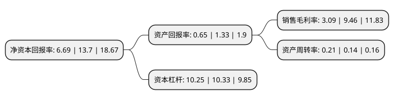

> 本页面由自动化程序生成于 2022年5月20日 01:26
> 内容可能存在错误，如有bug请提交issue至：https://github.com/Eroleice/doc-pi/issues
{.is-warning}

# 上市公司基本情况

## 基本资料

北京首都开发股份有限公司（以下简称“首开股份”）成立于1993年12月29日，北京市。于2001年03月12日在上交所主板上市。

首开股份注册资本257,956.524万元，主要业务:商品房，经济适用房，普通办公楼，商业设施以及土地的开发与销售。以下是详细信息：

- 公司名称: 北京首都开发股份有限公司
- 股票代码: 600376.SH
- 所在地: 北京 - 北京市
- 成立日期: 1993年12月29日
- 注册资本: 257,956.524万元
- 法定代表人: 李岩
- 主营业务: 商品房，经济适用房，普通办公楼，商业设施以及土地的开发与销售
- 公司官网: www.shoukaigufen.com
- 公司介绍: 公司是一家以房地产开发、商品房销售为主营业务、具备房地产开发一级资质的上市公司，主要定位于北京市场的房地产开发。公司自成立以来，先后成功开发了回龙观文化居住区、方庄小区、望京新城等规模超过百万平米的超大型居住社区以及大运村、奥运村、国家体育馆等一批国家重点项目，在业界享有很高声誉，在广大消费者心目中树立了良好品牌形象。公司开发的项目多次获得建设部、北京市和有关专业机构的嘉奖，荣获“中国房地产500强企业”称号等。经过多年的努力，公司践行“责任地产”的企业理念和“首开地产”的品牌深入人心，赢得了社会的广泛赞誉，具有较高的认知度和美誉度。公司拥有专业的营销人才和庞大的营销团队。“首开地产”的品牌，目前已经走出北京，走向全国，品牌影响力日益增强。

## 股东及高管情况

上市公司第一大股东为北京首都开发控股(集团)有限公司，持股1,215,584,048股，占比47.12%，为上市公司实际控制人。

截至2022年03月31日，上市公司的前十大股东中，共有6名机构股东，4个产品账户，其中5%以上大股东共有2名。上市公司前十大股东明细如下：

> 截至2022年03月31日，上市公司前十大股东信息如下：

| 股东名称 | 持股数量（股） | 持股比例 |
| --- | --- | --- |
| 北京首都开发控股(集团)有限公司 | 1,215,584,048 | 47.12% |
| 北京首开天鸿集团有限公司 | 142,714,290 | 5.53% |
| 君康人寿保险股份有限公司-万能保险产品 | 84,697,445 | 3.28% |
| 横琴人寿保险有限公司-分红委托11 | 76,113,924 | 2.95% |
| 招商银行股份有限公司-上证红利交易型开放式指数证券投资基金 | 71,341,315 | 2.77% |
| 苏州信托有限公司-苏信财富·富诚K1602单一资金信托 | 67,508,253 | 2.62% |
| 百年人寿保险股份有限公司-分红保险产品 | 62,660,150 | 2.43% |
| 陕西省国际信托股份有限公司-陕国投·汇祥11号定向投资集合资金信托计划 | 61,233,681 | 2.37% |
| 中央汇金资产管理有限责任公司 | 38,410,600 | 1.49% |
| 君康人寿保险股份有限公司-自有资金 | 38,310,642 | 1.49% |

## 利润表分析

上市公司2021年总收入为678.02亿元，净利润为20.95亿元，实现盈利。

## 杜邦分析

> 数据列示周期：2021年 | 2020年 | 2019年
{.is-info}

上市公司的净资产收益率在近一年有所下降，下降幅度为-51.17%，其变化情况分解如下：
- 上市公司的销售毛利率在近一年下降了-67.34%，可能是生产效率的下降、商品原材料价格上涨或商品价格的下跌所致。
- 上市公司的资产周转率在近一年上升了50%，可能是源自于更快的销售回款或库存管理效果提升。
- 上市公司的财务杠杆比率在近一年下降了-0.77%，可能是减少负债降低财务费用。

