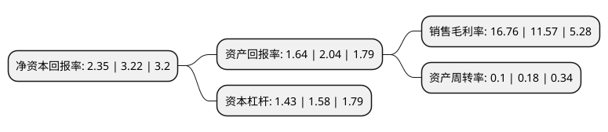

> 本页面由自动化程序生成于 2022年5月20日 01:27
> 内容可能存在错误，如有bug请提交issue至：https://github.com/Eroleice/doc-pi/issues
{.is-warning}

# 上市公司基本情况

## 基本资料

华丽家族股份有限公司（以下简称“华丽家族”）成立于1996年10月18日，上海市。于2002年07月09日在上交所主板上市。

华丽家族注册资本160,229万元，主营业务:股权投资以下是详细信息：

- 公司名称: 华丽家族股份有限公司
- 股票代码: 600503.SH
- 所在地: 上海 - 上海市
- 成立日期: 1996年10月18日
- 注册资本: 160,229万元
- 法定代表人: 王伟林
- 主营业务: 主营业务:股权投资
- 公司官网: www.deluxe-family.com
- 公司介绍: 公司是上海著名房地产开发集团之一，拥有国家建设部颁发的一级开发资质。公司以地产开发为核心业务，同时涉足建筑装饰(国家一级资质)、绿化环保等相关产业，并正在拓展商业地产、旅游地产、城市基础设施建设等业务。公司还积极开辟第二主业、涉及金融投资、生物制药、新能源、节能环保等股权运作投资,从而逐步培育公司新的业务增长点。公司自创立之日起，就一直专注于上海中心城区精品住宅的开发，以“开发的是土地，经营的是艺术，创造的是价值”为经营理念，凭借专业和富有活力的团队，成功开发了“浦东华丽家族花园”、“华丽家族·古北花园”等沪上知名的精品楼盘，累积数年开发的“檀香别墅”项目更是奠定了公司在上海房地产市场的领先地位。通过多年的经验积累和不断探索，公司已经从单个项目开发、单一的上海城区开发的项目型公司，逐渐发展成多个项目同时开发、跨区域开发的集团化运作的专业房地产开发商。

## 股东及高管情况

上市公司第一大股东为上海南江(集团)有限公司，持股114,020,000股，占比7.12%，**疑似为**上市公司实际控制人。

截至2022年03月31日，上市公司的前十大股东中，共有5名自然人股东，3名机构股东，2个产品账户，其中5%以上大股东共有2名。上市公司前十大股东明细如下：

> 未能通过持股比例判定出上市公司实际控制人（持股30%以上）
> 可能存在通过间接持股、联合持股、协议控制等方式拥有实际控制权的主体，具体请参考上市公司定期公告！
{.is-warning}

> 上市公司第一大股东持股不超过10%，请检查是否存在公司控制权风险！
{.is-danger}

> 截至2022年03月31日，上市公司前十大股东信息如下：

| 股东名称 | 持股数量（股） | 持股比例 |
| --- | --- | --- |
| 上海南江(集团)有限公司 | 114,020,000 | 7.12% |
| 上海泽熙增煦投资中心(有限合伙) | 90,000,000 | 5.62% |
| 闽发证券有限责任公司破产管理人 | 20,254,000 | 1.26% |
| 陈国东 | 8,770,011 | 0.55% |
| 左十一 | 7,141,400 | 0.45% |
| 项英良 | 6,562,200 | 0.41% |
| 李彤 | 6,079,495 | 0.38% |
| 华夏基金-中央汇金资产管理有限责任公司-华夏基金-汇金资管单一资产管理计划 | 5,924,600 | 0.37% |
| 中国工商银行股份有限公司-南方中证全指房地产交易型开放式指数证券投资基金 | 5,907,200 | 0.37% |
| 王成华 | 5,323,600 | 0.33% |

## 利润表分析

上市公司2021年总收入为5.24亿元，净利润为0.87亿元，实现盈利。

## 杜邦分析

> 数据列示周期：2021年 | 2020年 | 2019年
{.is-info}

上市公司的净资产收益率在近一年有所下降，下降幅度为-27.02%，其变化情况分解如下：
- 上市公司的销售毛利率在近一年上升了44.86%，可能是生产效率的提升、商品原材料价格下跌或商品价格的上涨所致。
- 上市公司的资产周转率在近一年下降了-44.44%，可能是源自于更慢的销售回款或库存管理效果下降。
- 上市公司的财务杠杆比率在近一年下降了-9.49%，可能是减少负债降低财务费用。

