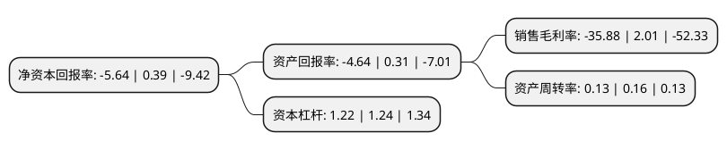

> 本页面由自动化程序生成于 2022年5月20日 01:27
> 内容可能存在错误，如有bug请提交issue至：https://github.com/Eroleice/doc-pi/issues
{.is-warning}

# 上市公司基本情况

## 基本资料

中珠医疗控股股份有限公司（以下简称“ST中珠”）成立于1994年06月27日，潜江市。于2001年05月18日在上交所主板上市。

ST中珠注册资本199,286.968万元，主营业务:医疗，医药和房地产以下是详细信息：

- 公司名称: 中珠医疗控股股份有限公司
- 股票代码: 600568.SH
- 所在地: 湖北 - 潜江市
- 成立日期: 1994年06月27日
- 注册资本: 199,286.968万元
- 法定代表人: 叶继革
- 主营业务: 主营业务:医疗，医药和房地产
- 公司官网: www.zz600568.com
- 公司介绍: 公司主要业务涉及医疗、医药和房地产。公司房地产业务主要在珠海、深圳、阳江和郴州。公司医药行业主要从事药品的研发、生产和销售。公司在研产品有抗肿瘤基因治疗的内皮抑素腺病毒注射液、益肾强骨治疗骨质疏松症的染料木素胶囊以及治疗胰腺癌的免疫调节剂中珠“1018”等。2016年公司通过发行股份购买资产收购一体医疗，一体医疗具有既能治疗颅内肿瘤，也能治疗体部实体肿瘤，获国家食品药品监督管理局SFDA注册证和欧盟CE认证，全球领先技术的月亮神全身伽玛刀；具有了采用最新超声弹性成像技术的无创诊断肝纤维化及肝硬化的检测仪，专家认可的领先肝病检测技术hepatest超声肝硬化检测仪。公司通过重大资产重组收购一体医疗，将吸收一体医疗与医院合作方面十多年的经营管理经验和较好的人才储备，就肿瘤诊疗业务更加积极有效地与医院开展合作，积极谋求向肿瘤医疗全产业链转型，确立向肿瘤医药、医疗、设备、大数据云转型的战略目标。

## 股东及高管情况

上市公司第一大股东为深圳市一体投资控股集团有限公司，持股252,324,862股，占比12.66%，**疑似为**上市公司实际控制人。

截至2022年04月07日，上市公司的前十大股东中，共有4名自然人股东，6名机构股东，其中5%以上大股东共有8名。上市公司前十大股东明细如下：

> 未能通过持股比例判定出上市公司实际控制人（持股30%以上）
> 可能存在通过间接持股、联合持股、协议控制等方式拥有实际控制权的主体，具体请参考上市公司定期公告！
{.is-warning}

> 截至2022年04月07日，上市公司前十大股东信息如下：

| 股东名称 | 持股数量（股） | 持股比例 |
| --- | --- | --- |
| 深圳市一体投资控股集团有限公司 | 252,324,862 | 12.66% |
| 肖妃英 | 164,555,403 | 8.26% |
| 广州云鹰资本管理有限公司 | 142,266,541 | 7.1388% |
| 深圳市朗地科技发展有限公司 | 127,848,000 | 6.42% |
| 深圳市朗地科技发展有限公司 | 127,848,000 | 6.42% |
| 珠海中珠集团股份有限公司 | 119,757,422 | 6.01% |
| 黄鹏斌 | 104,118,991 | 5.22% |
| 黄鹏斌 | 104,118,991 | 5.22% |
| 深圳市楷盛盈科技有限公司 | 66,308,400 | 3.33% |
| 曾亚美 | 56,926,989 | 2.86% |

## 利润表分析

上市公司2021年总收入为5.81亿元，净利润为-2.09亿元，**未实现盈利**。

## 杜邦分析

> 数据列示周期：2021年 | 2020年 | 2019年
{.is-info}

上市公司的净资产收益率在近一年有所下降，下降幅度为-1546.15%，其变化情况分解如下：
- 上市公司的销售毛利率在近一年下降了-1885.07%，可能是生产效率的下降、商品原材料价格上涨或商品价格的下跌所致。
- 上市公司的资产周转率在近一年下降了-18.75%，可能是源自于更慢的销售回款或库存管理效果下降。
- 上市公司的财务杠杆比率在近一年下降了-1.61%，可能是减少负债降低财务费用。

