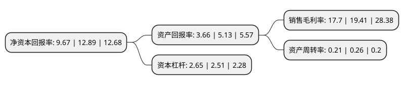

> 本页面由自动化程序生成于 2022年5月20日 01:27
> 内容可能存在错误，如有bug请提交issue至：https://github.com/Eroleice/doc-pi/issues
{.is-warning}

# 上市公司基本情况

## 基本资料

广汇物流股份有限公司（以下简称“广汇物流”）成立于1988年08月27日，成都市。于1992年01月13日在上交所主板上市。

广汇物流注册资本125,695.285万元，主营业务:物流园区投资，经营及配套服务(主要为美居物流园，租赁商业，商业保理经营业务)以及北站物流基地项目建设，并在此基础上阶段性新增优质住宅，商业地产的开发和销售业务。以下是详细信息：

- 公司名称: 广汇物流股份有限公司
- 股票代码: 600603.SH
- 所在地: 四川 - 成都市
- 成立日期: 1988年08月27日
- 注册资本: 125,695.285万元
- 法定代表人: 杨铁军
- 主营业务: 主营业务:物流园区投资，经营及配套服务(主要为美居物流园，租赁商业，商业保理经营业务)以及北站物流基地项目建设，并在此基础上阶段性新增优质住宅，商业地产的开发和销售业务
- 公司官网: www.chinaghwl.com
- 公司介绍: 公司主营业务为商贸物流综合服务产业，公司将以物流园经营业务为依托，以新型体验式业态为抓手，打造多业态并存的体验式商业区，并建设线上产品展示和交易平台，在将美居物流园发展成为乌鲁木齐市城北商业中心的愿景下，不断拓展新业态、新业务，持续提升公司竞争力。公司将把握新疆物流产业发展机遇，持续加快扩张整合，不断发掘现代物流产业链中具有发展潜质的企业，寻求并购重组的机会，系统性展开公司的商贸物流产业链布局，打造功能复合、配套完善的现代化物流产业综合服务平台，升级现有业务、拓展新的业务领域，增强综合竞争力和盈利能力，致力于成为“一带一路”重要物流节点的主要物流商贸服务商。

## 股东及高管情况

上市公司第一大股东为新疆广汇实业投资(集团)有限责任公司，持股541,213,926股，占比43.06%，为上市公司实际控制人。

截至2022年04月27日，上市公司的前十大股东中，共有1名自然人股东，7名机构股东，2个产品账户，其中5%以上大股东共有6名。上市公司前十大股东明细如下：

> 截至2022年04月27日，上市公司前十大股东信息如下：

| 股东名称 | 持股数量（股） | 持股比例 |
| --- | --- | --- |
| 新疆广汇实业投资(集团)有限责任公司 | 541,213,926 | 43.06% |
| 新疆广汇实业投资(集团)有限责任公司 | 541,213,926 | 43.06% |
| 新疆萃锦投资有限公司 | 81,545,320 | 6.49% |
| 新疆萃锦投资有限公司 | 81,545,320 | 6.49% |
| 西安龙达投资管理有限公司 | 68,604,508 | 5.46% |
| 西安龙达投资管理有限公司 | 68,384,508 | 5.4405% |
| 招商银行股份有限公司-上证红利交易型开放式指数证券投资基金 | 51,503,772 | 4.1% |
| 方奕忠 | 4,326,664 | 0.34% |
| 中国银行股份有限公司-华宝标普中国A股红利机会指数证券投资基金(LOF) | 4,054,500 | 0.32% |
| 华泰证券股份有限公司 | 3,352,084 | 0.27% |

## 利润表分析

上市公司2021年总收入为33.17亿元，净利润为5.87亿元，实现盈利。

## 杜邦分析

> 数据列示周期：2021年 | 2020年 | 2019年
{.is-info}

上市公司的净资产收益率在近一年有所下降，下降幅度为-24.98%，其变化情况分解如下：
- 上市公司的销售毛利率在近一年下降了-8.81%，可能是生产效率的下降、商品原材料价格上涨或商品价格的下跌所致。
- 上市公司的资产周转率在近一年下降了-19.23%，可能是源自于更慢的销售回款或库存管理效果下降。
- 上市公司的财务杠杆比率在近一年上升了5.58%，可能是增加负债扩大生产规模。

