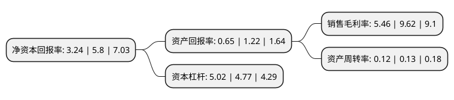

> 本页面由自动化程序生成于 2022年5月20日 01:27
> 内容可能存在错误，如有bug请提交issue至：https://github.com/Eroleice/doc-pi/issues
{.is-warning}

# 上市公司基本情况

## 基本资料

光大嘉宝股份有限公司（以下简称“光大嘉宝”）成立于1994年08月17日，上海市。于1992年12月03日在上交所主板上市。

光大嘉宝注册资本149,968.54万元，主要产品:商品房，电容器。以下是详细信息：

- 公司名称: 光大嘉宝股份有限公司
- 股票代码: 600622.SH
- 所在地: 上海 - 上海市
- 成立日期: 1994年08月17日
- 注册资本: 149,968.54万元
- 法定代表人: 张明翱
- 主营业务: 主要产品:商品房，电容器
- 公司官网: www.ebjb.com
- 公司介绍: 公司是国家一级房地产资质开发企业，拥有全资、控股、参股企业多家。目前，公司主要从事房地产开发业务和房地产基金业务。公司通过控股的光大安石平台作为私募基金管理人，重点投资于持有型物业，并以管理人的身份或以品牌输出的形式，对相关物业进行升级、改造、开发、运营等经营管理，获得相应的收益。公司已跨入大体量、多项目、跨区域、多业态地产开发的新阶段。公司通过改革、改制和整合已有产业结构，确立了“重点发展房地产业、巩固发展电子电容板块、择机发展高附加值产业、进一步优化产业结构、积极做好优质资源储备”的经营战略。

## 股东及高管情况

上市公司第一大股东为北京光控安宇投资中心(有限合伙)，持股211,454,671股，占比14.1%，**疑似为**上市公司实际控制人。

截至2022年03月31日，上市公司的前十大股东中，共有1名自然人股东，8名机构股东，1个产品账户，其中5%以上大股东共有5名。上市公司前十大股东明细如下：

> 未能通过持股比例判定出上市公司实际控制人（持股30%以上）
> 可能存在通过间接持股、联合持股、协议控制等方式拥有实际控制权的主体，具体请参考上市公司定期公告！
{.is-warning}

> 截至2022年03月31日，上市公司前十大股东信息如下：

| 股东名称 | 持股数量（股） | 持股比例 |
| --- | --- | --- |
| 北京光控安宇投资中心(有限合伙) | 211,454,671 | 14.1% |
| 上海嘉定建业投资开发有限公司 | 161,678,520 | 10.78% |
| 上海光控股权投资管理有限公司 | 148,392,781 | 9.89% |
| 上海嘉定伟业投资开发有限公司 | 94,540,386 | 6.3% |
| 上海安霞投资中心(有限合伙) | 77,559,297 | 5.17% |
| 上海嘉加(集团)有限公司 | 40,073,475 | 2.67% |
| 上海南翔资产经营有限公司 | 33,654,598 | 2.24% |
| 上海嘉定缘和贸易有限公司 | 29,322,479 | 1.96% |
| 上海浦东发展银行股份有限公司-中欧创新未来18个月封闭运作混合型证券投资基金 | 15,003,250 | 1% |
| 王暨钟 | 8,771,200 | 0.58% |

## 杜邦分析

> 数据列示周期：2021年 | 2020年 | 2019年
{.is-info}

上市公司的净资产收益率在近一年有所下降，下降幅度为-44.14%，其变化情况分解如下：
- 上市公司的销售毛利率在近一年下降了-43.24%，可能是生产效率的下降、商品原材料价格上涨或商品价格的下跌所致。
- 上市公司的资产周转率在近一年下降了-7.69%，可能是源自于更慢的销售回款或库存管理效果下降。
- 上市公司的财务杠杆比率在近一年上升了5.24%，可能是增加负债扩大生产规模。

