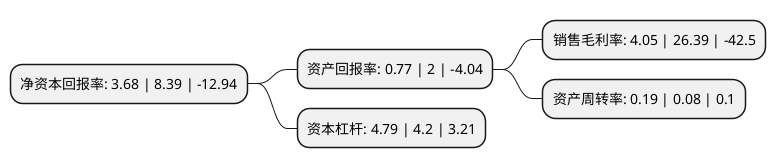

> 本页面由自动化程序生成于 2022年5月20日 01:27
> 内容可能存在错误，如有bug请提交issue至：https://github.com/Eroleice/doc-pi/issues
{.is-warning}

# 上市公司基本情况

## 基本资料

上海新黄浦实业集团股份有限公司（以下简称“新黄浦”）成立于1996年09月23日，上海市。于1993年03月26日在上交所主板上市。

新黄浦注册资本67,339.679万元，房地产业，工业。以下是详细信息：

- 公司名称: 上海新黄浦实业集团股份有限公司
- 股票代码: 600638.SH
- 所在地: 上海 - 上海市
- 成立日期: 1996年09月23日
- 注册资本: 67,339.679万元
- 法定代表人: 赵峥嵘
- 主营业务: 房地产业，工业
- 公司官网: www.600638.com
- 公司介绍: 公司是一家以房地产综合开发为主营业务的上市公司，系国家房地产综合开发一级资质企业，是上海市合同信用等级AAA级企业和上海市财务资信AAA级企业。自创立以来，在上海市内开发建设了一大批标志性商务楼宇和住宅小区。开发的著名商业楼宇包括：上海科技京城；坐落于上海外滩与“中华第一街”南京东路交汇处的新黄浦金融大厦；位踞上海浦东陆家嘴金融贸易区的永华大厦和阳光世界、上海北外滩新地标——浦江国际金融广场等。开发的主要住宅楼盘包括：凌家弄小区、陈家宅小区、由由小区、平江智荟苑、南馨佳苑、怡佳公寓等。出在做优做强房地产主业的同时，公司还在房地产相关的经营服务领域、旧城改造、金融投资及期货、创意园区建设与管理、高科技园区经营、专业电子市场经营、物业管理、房产服务与咨询、服务贸易等方面进行多元探索和拓展，成绩斐然。

## 股东及高管情况

上市公司第一大股东为上海新华闻投资有限公司，持股120,701,293股，占比17.92%，**疑似为**上市公司实际控制人。

截至2022年03月31日，上市公司的前十大股东中，共有4名机构股东，5个产品账户，1名其他股东，其中5%以上大股东共有3名。上市公司前十大股东明细如下：

> 未能通过持股比例判定出上市公司实际控制人（持股30%以上）
> 可能存在通过间接持股、联合持股、协议控制等方式拥有实际控制权的主体，具体请参考上市公司定期公告！
{.is-warning}

> 截至2022年03月31日，上市公司前十大股东信息如下：

| 股东名称 | 持股数量（股） | 持股比例 |
| --- | --- | --- |
| 上海新华闻投资有限公司 | 120,701,293 | 17.92% |
| 上海盛誉莲花股权投资基金合伙企业(有限合伙) | 115,162,770 | 17.1% |
| 上海市黄浦区国有资产监督管理委员会(上海市黄浦区集体资产监督管理委员会) | 85,107,090 | 12.64% |
| 中崇投资集团有限公司 | 31,923,241 | 4.74% |
| 北京禾晟源投资管理有限公司-禾晟源稳进二期私募证券投资基金 | 28,436,530 | 4.22% |
| 西藏信托有限公司-安坤5号集合资金信托计划 | 17,378,410 | 2.58% |
| 西藏信托有限公司-安坤8号集合资金信托计划 | 16,861,870 | 2.5% |
| 西藏信托有限公司-丹泽1号集合资金信托计划 | 13,896,600 | 2.06% |
| 福建天宝矿业投资集团股份有限公司 | 6,600,000 | 0.98% |
| 上海新黄浦(集团)有限责任公司 | 5,628,000 | 0.84% |

## 利润表分析

上市公司2021年总收入为39.41亿元，净利润为1.45亿元，实现盈利。

## 杜邦分析

> 数据列示周期：2021年 | 2020年 | 2019年
{.is-info}

上市公司的净资产收益率在近一年有所下降，下降幅度为-56.14%，其变化情况分解如下：
- 上市公司的销售毛利率在近一年下降了-84.65%，可能是生产效率的下降、商品原材料价格上涨或商品价格的下跌所致。
- 上市公司的资产周转率在近一年上升了137.5%，可能是源自于更快的销售回款或库存管理效果提升。
- 上市公司的财务杠杆比率在近一年上升了14.05%，可能是增加负债扩大生产规模。

