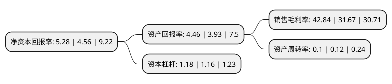

> 本页面由自动化程序生成于 2022年5月20日 01:27
> 内容可能存在错误，如有bug请提交issue至：https://github.com/Eroleice/doc-pi/issues
{.is-warning}

# 上市公司基本情况

## 基本资料

上海万业企业股份有限公司（以下简称“万业企业”）成立于1991年10月28日，上海市。于1993年04月07日在上交所主板上市。

万业企业注册资本95,793.04万元，商品房，酒店，旅游，高尔夫。以下是详细信息：

- 公司名称: 上海万业企业股份有限公司
- 股票代码: 600641.SH
- 所在地: 上海 - 上海市
- 成立日期: 1991年10月28日
- 注册资本: 95,793.04万元
- 法定代表人: 朱旭东
- 主营业务: 商品房，酒店，旅游，高尔夫
- 公司官网: www.600641.com.cn
- 公司介绍: 上海万业企业股份有限公司(“万业企业”，证券代码：600641)，成立于1991年10月，是一家具有新兴产业基因的高科技上市公司。目前，公司控股股东为上海浦东科技投资有限公司，占公司总股本的28.16%。第二与第三大股东分别为三林万业(上海)企业集团有限公司和国家集成电路产业投资基金股份有限公司，各持股份占公司总股本的13.53%和7%。公司通过借助平台优势，依托国内国外两个市场，利用境内与境外两种资源，通过“外延并购+产业整合”的方式，扎实推动公司快速向集成电路产业领域转型。2017年，公司以10亿元自有资金认购上海半导体装备材料产业投资基金，迈出了转型的第一步。2018年，公司成功收购上海凯世通半导体股份有限公司。凯世通是中国领先的离子注入机研发制造企业，其在全球光伏离子注入领域市占率第一，正在积极开发集成电路离子注入机。收购后，公司正式进入集成电路核心装备产业之一的离子注入机领域。

## 股东及高管情况

上市公司第一大股东为上海浦东科技投资有限公司，持股272,400,000股，占比28.44%，**疑似为**上市公司实际控制人。

截至2022年05月10日，上市公司的前十大股东中，共有1名自然人股东，5名机构股东，4个产品账户，其中5%以上大股东共有8名。上市公司前十大股东明细如下：

> 未能通过持股比例判定出上市公司实际控制人（持股30%以上）
> 可能存在通过间接持股、联合持股、协议控制等方式拥有实际控制权的主体，具体请参考上市公司定期公告！
{.is-warning}

> 截至2022年05月10日，上市公司前十大股东信息如下：

| 股东名称 | 持股数量（股） | 持股比例 |
| --- | --- | --- |
| 上海浦东科技投资有限公司 | 272,400,000 | 28.44% |
| 上海浦东科技投资有限公司 | 272,400,000 | 28.44% |
| 上海浦东科技投资有限公司 | 272,400,000 | 28.44% |
| 三林万业(上海)企业集团有限公司 | 108,224,088 | 11.2977% |
| 三林万业(上海)企业集团有限公司 | 106,644,388 | 11.1328% |
| 国家集成电路产业投资基金股份有限公司 | 48,558,810 | 5.0691% |
| 国家集成电路产业投资基金股份有限公司 | 48,558,810 | 5.0691% |
| 国家集成电路产业投资基金股份有限公司 | 48,558,810 | 5.07% |
| 王瑞生 | 6,749,700 | 0.7% |
| 中国工商银行股份有限公司-申万菱信新经济混合型证券投资基金 | 5,117,149 | 0.53% |

## 利润表分析

上市公司2021年总收入为8.79亿元，净利润为3.76亿元，实现盈利。

## 杜邦分析

> 数据列示周期：2021年 | 2020年 | 2019年
{.is-info}

上市公司的净资产收益率在近一年有所上升，上升幅度为15.79%，其变化情况分解如下：
- 上市公司的销售毛利率在近一年上升了35.27%，可能是生产效率的提升、商品原材料价格下跌或商品价格的上涨所致。
- 上市公司的资产周转率在近一年下降了-16.67%，可能是源自于更慢的销售回款或库存管理效果下降。
- 上市公司的财务杠杆比率在近一年上升了1.72%，可能是增加负债扩大生产规模。

