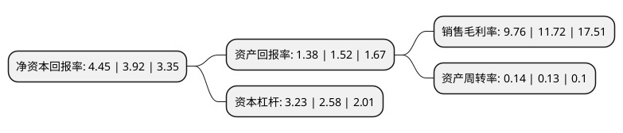

> 本页面由自动化程序生成于 2022年5月20日 01:28
> 内容可能存在错误，如有bug请提交issue至：https://github.com/Eroleice/doc-pi/issues
{.is-warning}

# 上市公司基本情况

## 基本资料

上海城投控股股份有限公司（以下简称“城投控股”）成立于1992年09月09日，上海市。于1993年05月18日在上交所主板上市。

城投控股注册资本252,957.563万元，原水供应，污水处理。以下是详细信息：

- 公司名称: 上海城投控股股份有限公司
- 股票代码: 600649.SH
- 所在地: 上海 - 上海市
- 成立日期: 1992年09月09日
- 注册资本: 252,957.563万元
- 法定代表人: 陈晓波
- 主营业务: 原水供应，污水处理
- 公司官网: www.sh600649.com
- 公司介绍: 公司是一家集环境业务、地产业务和股权投资业务为一体的具有较强核心竞争能力、国内一流的综合性现代服务企业。公司环境业务主要由下属中美合资上海环境集团有限公司运营。环境集团是国内规模最大的环境服务专业公司之一，提供城市生活垃圾中转运输、填埋和焚烧处理的全方位、综合性服务。业务覆盖上海、成都、南京、淮安、宁波、深圳、青岛、威海和漳州等城市。公司地产业务主要由下属上海城投置地(集团)有限公司运营。置地集团具有房地产开发一级资质，主要从事成片土地开发、普通商品房和保障性住房建设、历史建筑保留保护和现代科技园区开发，致力于成为国内房地产标杆企业。公司成功从单一水务业务向拥有环境业务、地产业务和投资业务等多元业务的战略转型。公司正努力成为一家核心主业突出、业务发展均衡、竞争能力较强的综合类上市公司，围绕金融和地产主线，以产融结合、以产带融、以融促产为发展模式，借助重组契机，转型发展成为专注于城市基础设施投融资及城市更新综合开发的投资控股集团。

## 股东及高管情况

上市公司第一大股东为上海城投(集团)有限公司，持股1,175,318,599股，占比46.46%，为上市公司实际控制人。

截至2022年03月31日，上市公司的前十大股东中，共有5名自然人股东，2名机构股东，2个产品账户，1个海外主体，其中5%以上大股东共有2名。上市公司前十大股东明细如下：

> 截至2022年03月31日，上市公司前十大股东信息如下：

| 股东名称 | 持股数量（股） | 持股比例 |
| --- | --- | --- |
| 上海城投(集团)有限公司 | 1,175,318,599 | 46.46% |
| 弘毅(上海)股权投资基金中心(有限合伙) | 160,614,847 | 6.35% |
| 李赣东 | 22,553,567 | 0.89% |
| 黄燕 | 18,000,000 | 0.71% |
| 中国工商银行股份有限公司-中证上海国企交易型开放式指数证券投资基金 | 11,417,068 | 0.45% |
| 陈能依 | 10,255,000 | 0.41% |
| 丁培芳 | 9,210,000 | 0.36% |
| MORGAN STANLEY & CO.   INTERNATIONAL PLC. | 8,204,530 | 0.32% |
| 中国银河资产管理有限责任公司 | 7,998,073 | 0.32% |
| 唐建华 | 7,509,679 | 0.3% |

## 利润表分析

上市公司2021年总收入为91.93亿元，净利润为8.97亿元，实现盈利。

## 杜邦分析

> 数据列示周期：2021年 | 2020年 | 2019年
{.is-info}

上市公司的净资产收益率在近一年有所上升，上升幅度为13.52%，其变化情况分解如下：
- 上市公司的销售毛利率在近一年下降了-16.72%，可能是生产效率的下降、商品原材料价格上涨或商品价格的下跌所致。
- 上市公司的资产周转率在近一年上升了7.69%，可能是源自于更快的销售回款或库存管理效果提升。
- 上市公司的财务杠杆比率在近一年上升了25.19%，可能是增加负债扩大生产规模。

