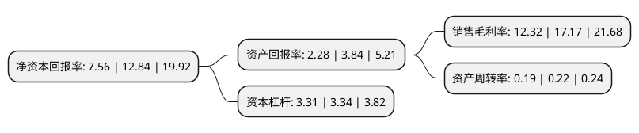

> 本页面由自动化程序生成于 2022年5月20日 01:28
> 内容可能存在错误，如有bug请提交issue至：https://github.com/Eroleice/doc-pi/issues
{.is-warning}

# 上市公司基本情况

## 基本资料

中华企业股份有限公司（以下简称“中华企业”）成立于1993年10月05日，上海市。于1993年09月24日在上交所主板上市。

中华企业注册资本609,613.525万元，房地产投资及其高科技开发，智能化物业管理和商品房经营租赁等业务。以下是详细信息：

- 公司名称: 中华企业股份有限公司
- 股票代码: 600675.SH
- 所在地: 上海 - 上海市
- 成立日期: 1993年10月05日
- 注册资本: 609,613.525万元
- 法定代表人: 李钟
- 主营业务: 房地产投资及其高科技开发，智能化物业管理和商品房经营租赁等业务
- 公司官网: www.cecl.com.cn
- 公司介绍: 公司是上海解放后第一家专业从事房地产开发经营的企业，主要从事房地产经营和开发。公司经过重大资产重组，完成了对上海房地产经营(集团)有限公司和上海古北(集团)有限公司的并购，三家国家一级资质的大型房地产企业实现了强强合作，公司的品牌和整体形象得到迅速提高。公司积极参与浦江两岸新一轮的开发建设，率先建成了浦东陆家嘴“财富广场”和北外滩“上海港国际客运中心”；积极投入中心地区包括旧区改造在内的城市建设、郊县一城九镇等区域的开发，以及苏州、杭州、江阴等长三角地区的项目开发建设，着力打造具有海派建筑风格的精品项目。公司先后荣获中国房地产综合效益百强企业、上海市房地产开发优秀企业、上海市房地产开发十大著名企业等荣誉称号。2018年公司通过重大资产重组收购中星集团100%股权，公司进一步加强降本增效管理，提升公司整体的运营健康水平。

## 股东及高管情况

上市公司第一大股东为上海地产(集团)有限公司，持股4,172,497,879股，占比68.44%，为上市公司实际控制人。

截至2022年03月31日，上市公司的前十大股东中，共有3名自然人股东，6名机构股东，1个产品账户，其中5%以上大股东共有2名。上市公司前十大股东明细如下：

> 截至2022年03月31日，上市公司前十大股东信息如下：

| 股东名称 | 持股数量（股） | 持股比例 |
| --- | --- | --- |
| 上海地产(集团)有限公司 | 4,172,497,879 | 68.44% |
| 华润置地控股有限公司 | 412,246,713 | 6.76% |
| 深圳市恩情投资发展有限公司 | 176,181,303 | 2.89% |
| 上海谐意资产管理有限公司 | 144,000,000 | 2.36% |
| 姚建华 | 48,573,756 | 0.8% |
| 中国工商银行股份有限公司-中证上海国企交易型开放式指数证券投资基金 | 40,331,566 | 0.66% |
| 平安不动产有限公司 | 35,847,540 | 0.59% |
| 深圳钦舟实业发展有限公司 | 19,590,139 | 0.32% |
| 李菁 | 18,051,520 | 0.3% |
| 朱丽红 | 16,628,712 | 0.27% |

## 利润表分析

上市公司2021年总收入为95.96亿元，净利润为11.81亿元，实现盈利。

## 杜邦分析

> 数据列示周期：2021年 | 2020年 | 2019年
{.is-info}

上市公司的净资产收益率在近一年有所下降，下降幅度为-41.12%，其变化情况分解如下：
- 上市公司的销售毛利率在近一年下降了-28.25%，可能是生产效率的下降、商品原材料价格上涨或商品价格的下跌所致。
- 上市公司的资产周转率在近一年下降了-13.64%，可能是源自于更慢的销售回款或库存管理效果下降。
- 上市公司的财务杠杆比率在近一年下降了-0.9%，可能是减少负债降低财务费用。

